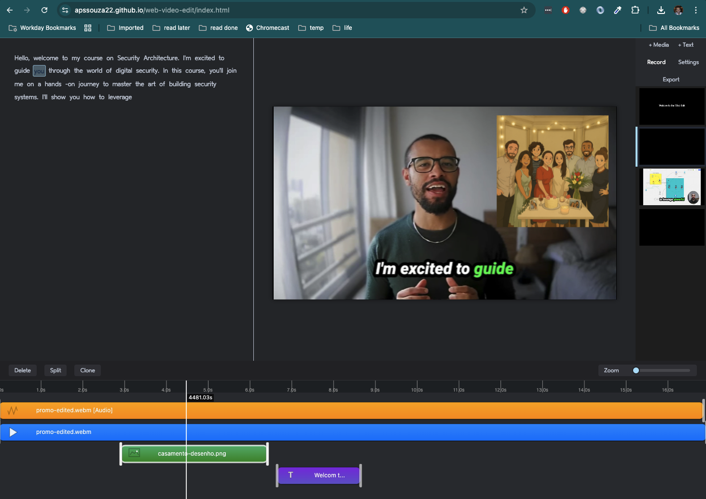

# Web Video Edit

Smart WebVideoFlow combines AI and modern web technologies to create a browser-based video editor that enables users to edit videos without downloading or installing any software - no downloads or installations required.




Features include:
- Upload video files directly from your device
- Trim and cut video clips
- Add text overlays and captions
- Use AI-powered tools for object detection and scene recognition
- Export edited videos in various formats
- All processing is done locally in the browser, ensuring user privacy and data security
- Utilizes WebAssembly and WebCodecs for high-performance video processing
- Leverages Webgpu for accelerated AI tasks
- No server-side processing, making it fast and efficient
- AI libraries for advanced video analysis and editing features
- Transcribe audio to text using Whisper model
- Text-to-speech using Kokoro model
- Video description using FastVLM model
- Apply filters and effects
- Background removal using segmentation models
- Search within videos using AI-generated metadata

## Demo

You can watch a demo of the Web Video Edit application on YouTube: [Web Video Edit Demo](https://www.youtube.com/watch?v=NcByGHQk-zM&t=45s&ab_channel=AlexsandroSouza).

You can try the demo at [smart-web-video-edit](https://apssouza22.github.io/web-video-edit/index.html).

## Architecture Documentation
The architecture documentation for the Web Video Edit application is available in the [docs/architecture](docs/architecture) directory. It includes detailed diagrams and explanations of the system's components, data flow, and module structure.


## Installation
WebEdit is a web application that uses vanilla JavaScript, HTML, and CSS. 

### Running with npm and http-server
1. Install dependencies:
```bash
npm install
```

2. Start the server:
```bash
npm start
```

3. Open your browser and navigate to http://localhost:8001

### Jest and ECMAScript Modules
To run tests using Jest with ECMAScript modules, follow these steps:
```
node --experimental-vm-modules
```

# TODOs
- Save the project to local storage including files
- Implement undo/redo functionality
- Add more video editing features (transitions, effects, etc.)
- Add search based on the vision results
- Add object detection with [YOLOv9](https://huggingface.co/spaces/Xenova/video-object-detection)
- Consider Adding background removal feature - https://huggingface.co/spaces/Xenova/webgpu-video-background-removal
- Consider using [Granite](https://huggingface.co/spaces/ibm-granite/Granite-4.0-Nano-WebGPU) for agents
- Consider using video tracking with [DINO]()(ttps://huggingface.co/spaces/webml-community/DINOv3-video-tracking)
- Consider replacing transcription with [Supertonic-TTS-WebGPU](https://huggingface.co/spaces/webml-community/Supertonic-TTS-WebGPU)