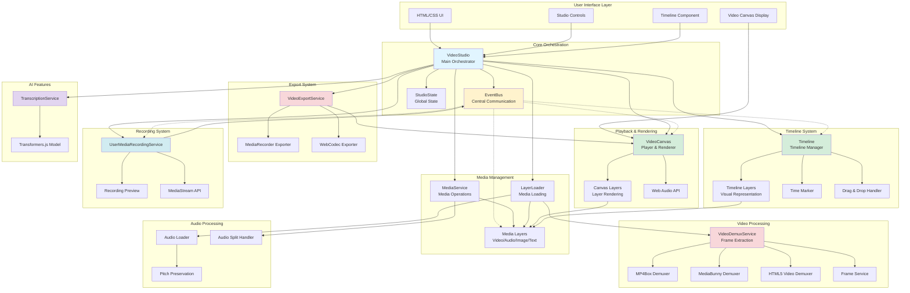

# System Overview Architecture

## High-Level Architecture

This diagram shows the main components of the Web Video Edit application and their relationships.

## Component Descriptions

### User Interface Layer
- **HTML/CSS UI**: Static HTML structure and styles
- **Studio Controls**: Play/pause, export, settings buttons
- **Timeline Component**: Visual timeline for media arrangement
- **Video Canvas Display**: Main canvas for video preview

### Core Orchestration
- **VideoStudio**: Main orchestrator that initializes and coordinates all subsystems
- **EventBus**: Centralized event system for decoupled communication
- **StudioState**: Singleton managing global application state

### Media Management
- **MediaService**: Handles media operations (split, clone, remove intervals)
- **LayerLoader**: Manages loading of different media types
- **Media Layers**: Abstract media representations (Video, Audio, Image, Text)

### Playback & Rendering
- **VideoCanvas**: Main player component with render loop
- **Canvas Layers**: Individual layer renderers with transformations
- **Web Audio API**: Audio playback synchronization

### Timeline System
- **Timeline**: Timeline manager handling display and interactions
- **Timeline Layers**: Visual representations of media on timeline
- **Time Marker**: Current time indicator
- **Drag & Drop Handler**: Media manipulation on timeline

### Video Processing
- **VideoDemuxService**: Orchestrates video demuxing strategy
- **MP4Box Demuxer**: MP4 demuxing using MP4Box.js (in Web Worker)
- **MediaBunny Demuxer**: Alternative demuxer using MediaBunny
- **HTML5 Video Demuxer**: Fallback using HTML5 video element
- **Frame Service**: Frame extraction and management

### Export System
- **VideoExportService**: Manages video export strategy
- **MediaRecorder Exporter**: Export using MediaRecorder API
- **WebCodec Exporter**: Export using WebCodecs API

### Recording System
- **UserMediaRecordingService**: Screen/camera recording orchestration
- **Recording Preview**: Live preview during recording
- **MediaStream API**: Capture display or camera

### AI Features
- **TranscriptionService**: Manages video transcription
- **Transformers.js Model**: AI model for speech-to-text

### Audio Processing
- **Audio Loader**: Loads and decodes audio files
- **Audio Split Handler**: Handles audio splitting operations
- **Pitch Preservation**: Maintains pitch during speed changes

## Communication Patterns

### Event-Driven Communication (shown with dotted lines)
Components communicate through the EventBus rather than direct coupling:
- Player emits time updates → Timeline synchronizes
- Timeline emits layer updates → Player refreshes
- Record emits video file created → Studio loads media
- UI emits speed changes → Media layers adjust

### Direct Dependencies (shown with solid lines)
Some components have direct relationships:
- Studio manages lifecycle of all subsystems
- LayerLoader uses Demux services to load video
- Player renders CanvasLayers
- Export uses Player for rendering frames

## Initialization Flow

## Data Flow Summary

1. **User uploads media** → LayerLoader → Demux/AudioLoader → Media Layer → EventBus (load update)
2. **User interacts with timeline** → Timeline → EventBus → Player updates
3. **Playback** → Player render loop → Canvas Layers → Media Layers render
4. **Export** → VideoExportService → Player renders frames → MediaRecorder/WebCodec → Download
5. **Recording** → UserMediaRecordingService → MediaStream → MediaRecorder → EventBus → Studio loads

## Technology Integration

### Web APIs Used
- **Canvas 2D API**: Video rendering and effects
- **Web Audio API**: Audio playback and synchronization
- **MediaRecorder API**: Recording and export
- **WebCodecs API**: Advanced video encoding/decoding
- **MediaStream API**: Screen and camera capture
- **File API**: File handling and reading

### External Libraries
- **MP4Box.js**: MP4 demuxing in Web Worker
- **MediaBunny**: Alternative video demuxing
- **Transformers.js**: AI transcription
- **webm-duration-fix**: Fix WebM duration metadata

## Design Patterns

1. **Singleton Pattern**: StudioState, EventBus
2. **Factory Pattern**: Timeline layer creation, Demuxer creation
3. **Observer Pattern**: EventBus pub/sub system
4. **Strategy Pattern**: Multiple demuxer strategies
5. **Facade Pattern**: VideoStudio as system facade

