# Module Structure

## Package Organization

The application is organized into domain-driven modules under `src/`. Each module is self-contained and follows single responsibility principle.

```mermaid
flowchart TB
 subgraph s1["studio/"]
        Studio["studio.ts<br>VideoStudio"]
        StudioInit["initilizer.ts"]
        StudioEvents["studio-event-handler.ts"]
        StudioControls["controls.ts"]
        ControlHandler["control-handler.ts"]
        DragHandler["drag-handler.ts"]
        LayerLoader["layer-loader.ts"]
        Settings["settings.ts"]
        AspectRatio["aspect-ratio-selector.ts"]
        SpeedControl["speed-control-input.ts"]
        LoadingPopup["loading-popup.ts"]
  end
 subgraph s2["canvas/"]
        Canvas["canvas.ts<br>VideoCanvas"]
        CanvasLayer["canvas-layer.ts"]
        CanvasTypes["types.ts"]
        CanvasIndex["index.ts"]
  end
 subgraph s3["timeline/layers/"]
        AudioTL["audio-timeline-layer.ts"]
        VideoTL["video-timeline-layer.ts"]
        ImageTL["image-timeline-layer.ts"]
        TextTL["text-timeline-layer.ts"]
  end
 subgraph s4["timeline/"]
        Timeline["timeline.ts<br>Timeline"]
        TLLayer["timeline-layer.ts"]
        TLFactory["timeline-layer-factory.ts"]
        TLRender["tllayer-render.ts"]
        TLPreview["preview.ts"]
        TLDrag["drag.ts"]
        TLZoom["zoom.ts"]
        TimeMarker["time-marker.ts"]
        LayerReorder["layer-reorder-handler.ts"]
        TLTypes["types.ts"]
        s3
  end
 subgraph s5["media/"]
        MediaService["media-service.ts"]
        MediaCommon["media-common.ts<br>AbstractMedia"]
        MediaVideo["video.ts<br>VideoLayer"]
        MediaAudio["audio.ts<br>AudioLayer"]
        MediaImage["image.ts<br>ImageLayer"]
        MediaText["text.ts<br>TextLayer"]
        MediaTypes["types.ts"]
        SpeedController["speed-controller.ts"]
        MediaIndex["index.ts"]
  end
 subgraph s6["htmldemuxer/"]
        HTMLDemux["html-video-demuxer.ts"]
        FrameQuality["frame-quality.ts"]
  end
 subgraph s7["mp4boxdemuxer/"]
        CodecDemux["codec-demuxer.js"]
        MP4Worker["worker.js"]
        VideoDecoder["video-decoder.js"]
        AudioDecoder["audio-decoder.js"]
  end
 subgraph s8["video/demux/"]
        VideoDemux["video-demux.ts<br>VideoDemuxService"]
        MediaBunnyDemux["mediabunny-demuxer.ts"]
        DemuxIndex["index.ts"]
        s6
        s7
  end
 subgraph s9["video/muxer/"]
        VideoExport["video-export-service.ts"]
        MediaRecorderExp["media-recorder-exporter.ts"]
        WebCodecExp["web-codec-exporter.ts"]
        MuxerIndex["index.ts"]
  end
 subgraph s10["video/"]
        VideoLoader["video-loader.ts"]
        s8
        s9
  end
 subgraph s11["audio/"]
        AudioLoader["audio-loader.ts"]
        AudioSource["audio-source.ts"]
        AudioCutter["audio-cutter.ts"]
        AudioSplit["AudioSplitHandler.ts"]
        PitchProcessor["pitch-preservation-processor.ts"]
  end
 subgraph s12["record/"]
        RecordService["service.ts<br>UserMediaRecordingService"]
        RecordControls["controls.ts"]
        RecordPreview["preview.ts"]
        RecordIndex["index.ts"]
  end
 subgraph s13["transcription/"]
        Transcription["transcription.ts<br>TranscriptionService"]
        TranscriptionView["transcription-view.ts"]
        TranscriptionModel["model.ts"]
        TranscriptionWorker["worker.ts"]
        TranscriptionTypes["types.ts"]
        TranscriptionIndex["index.ts"]
  end
 subgraph s14["frame/"]
        Frames["frames.ts<br>FrameService"]
        Frame["frame.ts"]
        FrameAdjust["frame-adjust.ts"]
        FrameTypes["types.ts"]
        FrameIndex["index.ts"]
  end
 subgraph s15["animation/"]
        Animation["animation.js"]
        AnimationIndex["index.js"]
  end
 subgraph s16["common/"]
        EventBus["event-bus.ts<br>EventBus"]
        StudioState["studio-state.ts<br>StudioState"]
        Utils["utils.ts"]
        BrowserSupport["browser-support.ts"]
        Render2D["render-2d.ts"]
        PinchHandler["pinch-handler.ts"]
        CommonIndex["index.ts"]
  end
 subgraph s17["src/"]
        Main["main.js/main.ts<br>Entry Point"]
        s1
        s2
        s4
        s5
        s10
        s11
        s12
        s13
        s14
        s15
        s16
  end
    Main --> Studio & RecordControls
    Studio --> StudioInit & Canvas & Timeline & MediaService & LayerLoader & VideoExport & Transcription & RecordService
    StudioInit --> Studio & StudioEvents
    Canvas --> CanvasLayer
    CanvasLayer --> MediaCommon
    Timeline --> TLLayer & TLFactory
    TLFactory --> AudioTL & VideoTL & ImageTL & TextTL
    MediaService --> MediaVideo & MediaAudio & MediaImage & MediaText & AudioSplit
    LayerLoader --> MediaVideo & MediaAudio & MediaImage & MediaText & VideoLoader & AudioLoader
    VideoLoader --> VideoDemux
    VideoDemux --> MediaBunnyDemux & HTMLDemux & CodecDemux
    VideoExport --> MediaRecorderExp & WebCodecExp
    RecordService --> RecordPreview
    Transcription --> TranscriptionModel & TranscriptionWorker
    AudioLoader --> PitchProcessor

    style Studio fill:#e1f5ff
    style Canvas fill:#d4edda
    style Timeline fill:#d4edda
    style MediaService fill:#fff3cd
    style VideoDemux fill:#f8d7da
    style VideoExport fill:#f8d7da
    style RecordService fill:#d1ecf1
    style Transcription fill:#e2d5f0
    style EventBus fill:#fff3cd



```



## Module Responsibilities

### 📦 studio/
**Responsibility**: Main application orchestration and UI control

**Key Classes**:
- `VideoStudio` - Main orchestrator, initializes all subsystems
- `StudioEventHandler` - Handles DOM events and user interactions
- `StudioControls` - Playback and export controls
- `ControlsHandler` - Media transformation controls
- `LayerLoader` - Loads media files into layers
- `DragHandler` - Canvas drag and transform functionality
- `AspectRatioSelector` - Aspect ratio management
- `SpeedControlInput` - Speed adjustment UI
- `LoadingPopup` - Loading state UI

**Dependencies**: canvas, timeline, media, video, audio, record, transcription, common

---

### 🎨 canvas/
**Responsibility**: Video canvas rendering and playback

**Key Classes**:
- `VideoCanvas` - Main player with render loop and time management
- `CanvasLayer` - Individual layer rendering with transformations

**Features**:
- 2D canvas rendering
- Audio synchronization via Web Audio API
- Layer transformations (move, resize, rotate)
- Playback controls
- Time-based rendering

**Dependencies**: media, common

---

### ⏱️ timeline/
**Responsibility**: Timeline UI and media arrangement

**Key Classes**:
- `Timeline` - Timeline manager
- `TimelineLayer` - Base timeline layer renderer
- `TimelineLayerFactory` - Creates specific timeline layer types
- `TimelineLayerRender` - Orchestrates layer rendering on timeline
- `AudioTimelineLayer`, `VideoTimelineLayer`, `ImageTimelineLayer`, `TextTimelineLayer` - Type-specific renderers

**Features**:
- Visual timeline representation
- Drag and drop media
- Zoom and pan
- Time marker
- Layer reordering
- Waveform display for audio

**Dependencies**: media, common

---

### 🎬 media/
**Responsibility**: Media layer abstractions and operations

**Key Classes**:
- `AbstractMedia` - Base class for all media types
- `VideoLayer` - Video media layer
- `AudioLayer` - Audio media layer
- `ImageLayer` - Image media layer
- `TextLayer` - Text media layer
- `MediaService` - Media operations (split, clone, remove intervals)
- `SpeedController` - Speed adjustment logic

**Features**:
- Unified media interface
- Frame-based rendering
- Time-based operations
- Speed control
- Transform properties

**Dependencies**: audio, frame, common

---

### 🎥 video/
**Responsibility**: Video demuxing and muxing

#### video/demux/
**Key Classes**:
- `VideoDemuxService` - Demuxing strategy orchestrator
- `MediaBunnyDemuxer` - MediaBunny-based demuxing
- `CodecDemuxer` - MP4Box.js demuxing (Web Worker)
- `HTMLVideoDemuxer` - HTML5 video fallback

**Features**:
- Multiple demuxing strategies
- Automatic codec detection
- Frame extraction
- Metadata extraction
- Progress tracking

#### video/muxer/
**Key Classes**:
- `VideoExportService` - Export orchestrator
- `MediaRecorderExporter` - MediaRecorder API export
- `WebCodecExporter` - WebCodecs API export

**Features**:
- Multiple export strategies
- Format selection
- Quality control
- Progress tracking

**Dependencies**: frame, canvas, common

---

### 🔊 audio/
**Responsibility**: Audio processing and manipulation

**Key Classes**:
- `AudioLoader` - Loads and decodes audio
- `AudioSource` - Audio source management
- `AudioCutter` - Audio cutting operations
- `AudioSplitHandler` - Audio splitting logic
- `PitchPreservationProcessor` - Maintains pitch during speed changes

**Features**:
- Audio decoding
- Audio buffer management
- Pitch preservation
- Audio splitting
- Web Audio API integration

**Dependencies**: common

---

### 📹 record/
**Responsibility**: Screen and camera recording

**Key Classes**:
- `UserMediaRecordingService` - Recording orchestrator
- `RecordingPreview` - Live preview component
- `RecordControls` - Recording UI controls

**Features**:
- Screen capture (getDisplayMedia)
- Camera capture (getUserMedia)
- MediaRecorder integration
- Preview during recording
- Audio mixing (screen + microphone)
- Memory management
- WebM duration fixing

**Dependencies**: common

---

### 📝 transcription/
**Responsibility**: AI-powered speech-to-text

**Key Classes**:
- `TranscriptionService` - Transcription orchestrator
- `TranscriptionView` - Transcription UI
- `TranscriptionModel` - AI model management (Web Worker)

**Features**:
- Speech-to-text using Transformers.js
- Word-level timestamps
- Interactive transcript
- Seek to timestamp
- Remove intervals based on transcript

**Dependencies**: common

---

### 🖼️ frame/
**Responsibility**: Frame management and extraction

**Key Classes**:
- `FrameService` - Frame collection management
- `Frame` - Individual frame representation
- `FrameAdjust` - Frame adjustment utilities

**Features**:
- Frame storage and retrieval
- Frame interpolation
- Frame quality management

**Dependencies**: common

---

### 🎭 animation/
**Responsibility**: Animation utilities

**Key Classes**:
- Animation helpers for smooth transitions

**Dependencies**: None

---

### 🛠️ common/
**Responsibility**: Shared utilities and infrastructure

**Key Classes**:
- `EventBus` - Centralized event system
- `StudioState` - Global state singleton
- `Utils` - Utility functions
- `BrowserSupport` - Browser capability detection
- `Render2D` - Canvas rendering utilities
- `PinchHandler` - Touch/pinch gesture handling

**Features**:
- Type-safe events
- Global state management
- Browser detection
- Utility functions
- Touch support

**Dependencies**: None (foundation module)

---

## Module Dependency Rules

### ✅ Allowed Dependencies
1. Any module can depend on `common/`
2. Higher-level modules (studio) can depend on lower-level modules (media, canvas, timeline)
3. Services can depend on domain modules within their scope

### ❌ Forbidden Dependencies
1. `common/` should not depend on any domain module
2. Domain modules should not depend on `studio/`
3. Circular dependencies between domain modules
4. Direct coupling between parallel domains (use EventBus instead)

### Communication Pattern
Modules communicate through:
1. **EventBus** for decoupled communication
2. **Factory functions** for object creation
3. **Dependency injection** via constructors
4. **Callbacks** for specific operations

## File Naming Conventions

- **kebab-case** for all files and directories
- **PascalCase** for classes
- **camelCase** for functions and variables
- **UPPER_SNAKE_CASE** for constants

Examples:
- `video-demux.ts` contains `VideoDemuxService`
- `timeline-layer-factory.ts` contains `TimelineLayerFactory`
- `event-bus.ts` contains `EventBus`

## Module Interfaces

### Typical Module Structure
```
module-name/
├── index.ts           # Public API exports
├── types.ts           # TypeScript types/interfaces
├── main-class.ts      # Main class implementation
├── helper-class.ts    # Helper classes
└── utils.ts           # Module-specific utilities
```

### Index Files
Each major module has an `index.ts` that exports the public API:
- Hides internal implementation details
- Provides clean import paths
- Acts as the module boundary

Example:
```typescript
// src/video/demux/index.ts
export { VideoDemuxService } from './video-demux';
export function createDemuxer(): VideoDemuxService {
  return new VideoDemuxService(/*...*/);
}
```

## Testing Structure

Tests mirror the source structure under `tests/`:
```
tests/
├── audio/              # Audio module tests
├── video/              # Video module tests
├── studio/             # Studio module tests
├── common/             # Common module tests
└── setup.js            # Jest setup and mocks
```

Test files use `.test.ts` or `.spec.ts` extension.

