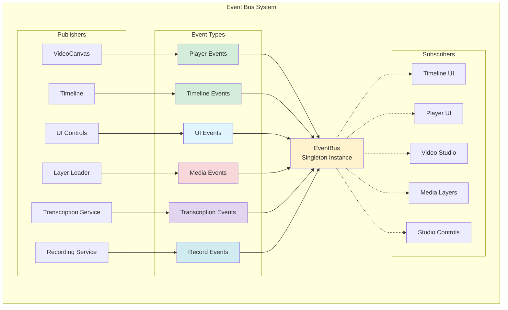
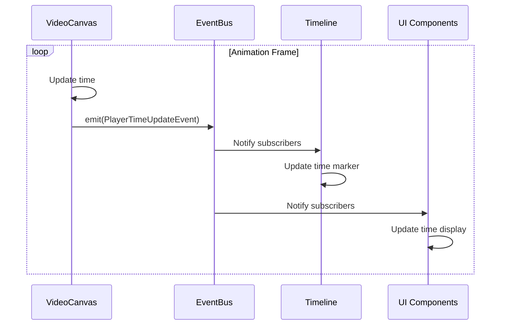
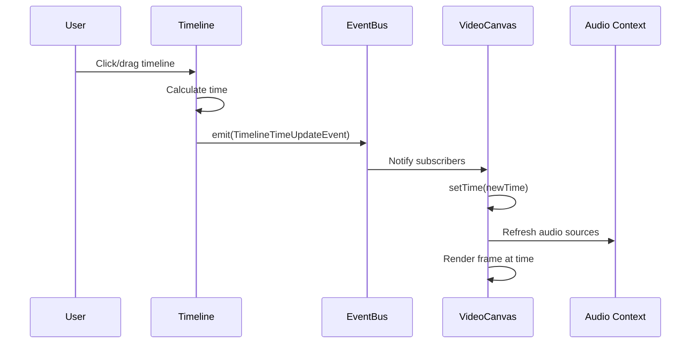
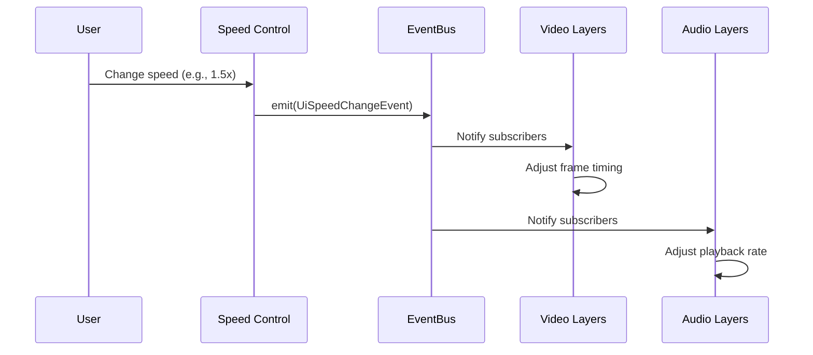
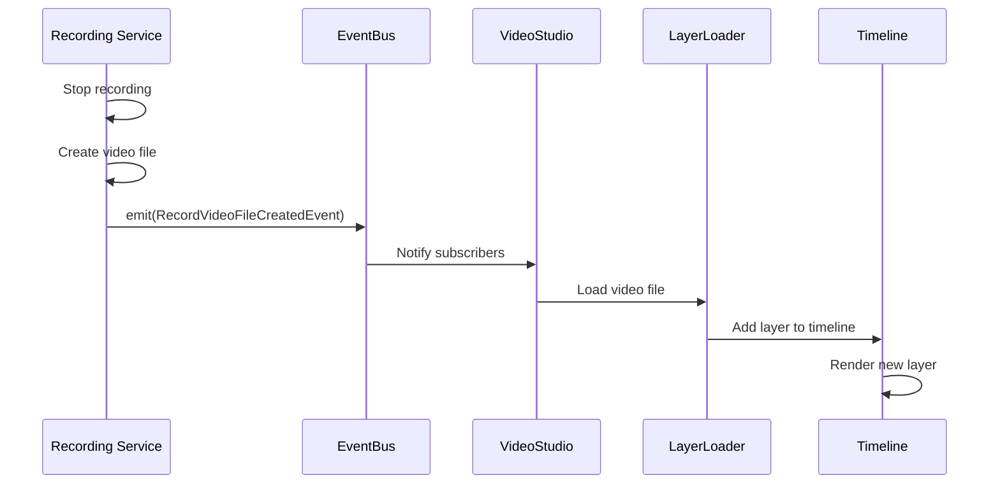
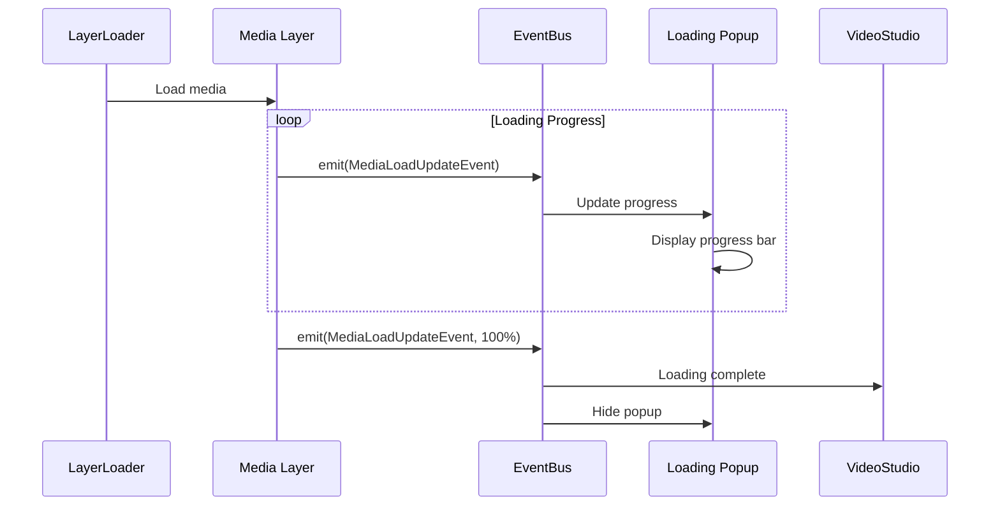

# Event System Architecture

## Overview

The application uses a centralized, type-safe EventBus for decoupled communication between modules. This event-driven architecture allows components to communicate without direct dependencies.

## EventBus Architecture



## Event Types

### Player Events

#### PlayerTimeUpdateEvent
Emitted when the playback time changes.

```typescript
class PlayerTimeUpdateEvent extends BaseEvent {
  readonly name = 'player:timeUpdate';
  constructor(
    public newTime: number,  // Current time in milliseconds
    public oldTime: number   // Previous time in milliseconds
  )
}
```

**Publisher**: `VideoCanvas`  
**Subscribers**: `Timeline` (sync time marker)

**Usage Example**:
```typescript
// Publishing
this.eventBus.emit(new PlayerTimeUpdateEvent(1500, 1000));

// Subscribing
eventBus.subscribe(PlayerTimeUpdateEvent, (event) => {
  console.log(`Time changed from ${event.oldTime} to ${event.newTime}`);
  // Update timeline marker
});
```

---

#### PlayerLayerTransformedEvent
Emitted when a layer is transformed (moved, resized, rotated).

```typescript
class PlayerLayerTransformedEvent extends BaseEvent {
  readonly name = 'player:layerTransformed';
  constructor(public layer: AbstractMedia)
}
```

**Publisher**: `VideoCanvas` (via CanvasLayer)  
**Subscribers**: `Timeline`, `StudioControls` (update UI)

---

### Timeline Events

#### TimelineTimeUpdateEvent
Emitted when the timeline time changes (user seeks).

```typescript
class TimelineTimeUpdateEvent extends BaseEvent {
  readonly name = 'timeline:timeUpdate';
  constructor(
    public newTime: number,  // Seek time in milliseconds
    public oldTime: number   // Previous time in milliseconds
  )
}
```

**Publisher**: `Timeline`  
**Subscribers**: `VideoCanvas` (update playback position)

---

#### TimelineLayerUpdateEvent
Emitted when a layer is updated on the timeline.

```typescript
class TimelineLayerUpdateEvent extends BaseEvent {
  readonly name = 'timeline:layerUpdate';
  constructor(
    public action: LayerUpdateKind,      // 'select' | 'delete' | 'split' | 'clone' | 'reorder'
    public layer: MediaInterface,         // Affected layer
    public oldLayer?: MediaInterface,     // Previous state (for split)
    public extra?: LayerReorderData      // Reorder info
  )
}
```

**Publisher**: `Timeline`  
**Subscribers**: `VideoStudio` (update layer state)

**Actions**:
- `select`: User selected a layer
- `delete`: User deleted a layer
- `split`: User split a layer
- `clone`: User cloned a layer
- `reorder`: User reordered layers

---

### UI Events

#### UiSpeedChangeEvent
Emitted when the playback speed changes.

```typescript
class UiSpeedChangeEvent extends BaseEvent {
  readonly name = 'ui:speedChange';
  constructor(public speed: number)  // Speed multiplier (0.5, 1.0, 2.0, etc.)
}
```

**Publisher**: `SpeedControlInput`  
**Subscribers**: Media layers (adjust playback speed)

---

#### UiAspectRatioChangeEvent
Emitted when the canvas aspect ratio changes.

```typescript
class UiAspectRatioChangeEvent extends BaseEvent {
  readonly name = 'ui:aspectRatioChange';
  constructor(
    public ratio: string,      // New ratio (e.g., "16:9")
    public oldRatio?: string   // Previous ratio
  )
}
```

**Publisher**: `AspectRatioSelector`  
**Subscribers**: `VideoCanvas` (resize canvas)

---

### Media Events

#### MediaLoadUpdateEvent
Emitted during media loading progress.

```typescript
class MediaLoadUpdateEvent extends BaseEvent {
  readonly name = 'media:loadUpdate';
  constructor(
    public layer: AbstractMedia,              // Loading layer
    public progress: number,                  // Progress percentage (0-100)
    public ctx?: CanvasRenderingContext2D,   // Canvas context
    public audioBuffer?: AudioBuffer          // Audio buffer (for audio layers)
  )
}
```

**Publisher**: Media layers during loading  
**Subscribers**: `LoadingPopup`, `VideoStudio` (update loading state)

---

### Transcription Events

#### TranscriptionRemoveIntervalEvent
Emitted when removing a time interval based on transcript.

```typescript
class TranscriptionRemoveIntervalEvent extends BaseEvent {
  readonly name = 'transcription:removeInterval';
  constructor(
    public startTime: number,  // Start time in seconds
    public endTime: number     // End time in seconds
  )
}
```

**Publisher**: `TranscriptionService`  
**Subscribers**: `MediaService` (remove intervals from layers)

---

#### TranscriptionSeekEvent
Emitted when seeking to a timestamp from transcript.

```typescript
class TranscriptionSeekEvent extends BaseEvent {
  readonly name = 'transcription:seek';
  constructor(public timestamp: number)  // Timestamp in seconds
}
```

**Publisher**: `TranscriptionView`  
**Subscribers**: `VideoCanvas` (seek to timestamp)

---

### Recording Events

#### RecordVideoFileCreatedEvent
Emitted when a recording is completed and video file is created.

```typescript
class RecordVideoFileCreatedEvent extends BaseEvent {
  readonly name = 'record:videoFileCreated';
  constructor(public videoFile: File)  // Recorded video file
}
```

**Publisher**: `UserMediaRecordingService`  
**Subscribers**: `VideoStudio` (load recorded video into timeline)

---

## EventBus API

### Subscribe to Event
```typescript
const eventBus = getEventBus();

const unsubscribe = eventBus.subscribe(PlayerTimeUpdateEvent, (event) => {
  console.log('Time updated:', event.newTime);
});

// Later: unsubscribe
unsubscribe();
```

### Subscribe Once
```typescript
eventBus.once(MediaLoadUpdateEvent, (event) => {
  console.log('Media loaded:', event.layer.name);
});
```

### Emit Event
```typescript
eventBus.emit(new UiSpeedChangeEvent(1.5));
```

### Check for Listeners
```typescript
if (eventBus.hasListeners(PlayerTimeUpdateEvent)) {
  console.log('Someone is listening to time updates');
}
```

### Count Listeners
```typescript
const count = eventBus.listenerCount(TimelineLayerUpdateEvent);
console.log(`${count} listeners for layer updates`);
```

### Clear Listeners
```typescript
// Clear specific event type
eventBus.clear(PlayerTimeUpdateEvent);

// Clear all listeners
eventBus.clear();
```

## Event Flow Examples

### Playback Time Synchronization



### User Seeks on Timeline



### Speed Change Flow



### Recording Completion Flow



### Media Loading Flow



## Type Safety

The EventBus uses TypeScript generics for type-safe event handling:

```typescript
type EventHandler<T extends BaseEvent> = (event: T) => void;
type EventClass<T extends BaseEvent> = new (...args: any[]) => T;

subscribe<T extends BaseEvent>(
  EventClass: EventClass<T>,
  handler: EventHandler<T>
): () => void
```

**Benefits**:
- Compile-time type checking
- IDE autocomplete for event properties
- Prevents type mismatches
- Clear event contracts

## Error Handling

The EventBus catches and logs errors in event handlers:

```typescript
emit<T extends BaseEvent>(event: T): void {
  listeners.forEach(handler => {
    try {
      handler(event);
    } catch (error) {
      console.error(`Error in event handler for ${event.name}:`, error);
    }
  });
}
```

**Benefits**:
- One failing handler doesn't break others
- Errors are logged for debugging
- System remains stable

## Best Practices

### 1. Use Specific Event Types
✅ Good: `PlayerTimeUpdateEvent`  
❌ Bad: Generic event with string type

### 2. Immutable Event Data
Events should be read-only:
```typescript
class MyEvent extends BaseEvent {
  readonly name = 'my:event';
  constructor(public readonly data: string) {
    super();
  }
}
```

### 3. Unsubscribe When Done
```typescript
class MyComponent {
  private unsubscribe: () => void;
  
  init() {
    this.unsubscribe = eventBus.subscribe(MyEvent, this.handleEvent);
  }
  
  cleanup() {
    this.unsubscribe();
  }
}
```

### 4. Use `once()` for One-Time Events
```typescript
// Wait for media to load
eventBus.once(MediaLoadUpdateEvent, (event) => {
  if (event.progress === 100) {
    console.log('Media fully loaded');
  }
});
```

### 5. Avoid Circular Event Chains
Don't create events that trigger themselves indirectly.

### 6. Document Event Purpose
Each event should have a clear purpose and ownership.

## Testing Events

```typescript
describe('EventBus', () => {
  let eventBus: EventBus;
  
  beforeEach(() => {
    eventBus = new EventBus();
  });
  
  it('should notify subscribers', () => {
    const handler = jest.fn();
    eventBus.subscribe(PlayerTimeUpdateEvent, handler);
    
    eventBus.emit(new PlayerTimeUpdateEvent(100, 0));
    
    expect(handler).toHaveBeenCalledWith(
      expect.objectContaining({ newTime: 100, oldTime: 0 })
    );
  });
  
  it('should support unsubscribe', () => {
    const handler = jest.fn();
    const unsubscribe = eventBus.subscribe(PlayerTimeUpdateEvent, handler);
    
    unsubscribe();
    eventBus.emit(new PlayerTimeUpdateEvent(100, 0));
    
    expect(handler).not.toHaveBeenCalled();
  });
});
```

## Singleton Pattern

The EventBus uses a singleton pattern:

```typescript
let globalEventBusInstance: EventBus | null = null;

export function getEventBus(): EventBus {
  if (!globalEventBusInstance) {
    globalEventBusInstance = new EventBus();
  }
  return globalEventBusInstance;
}

export function resetEventBus(): void {
  if (globalEventBusInstance) {
    globalEventBusInstance.clear();
  }
  globalEventBusInstance = null;
}
```

This ensures:
- Single instance across the application
- Can be reset for testing
- Easy access from any module

