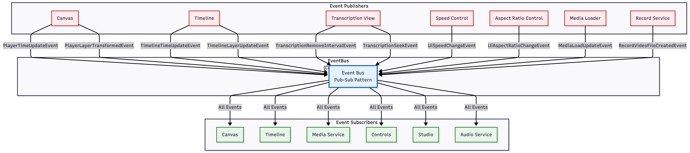
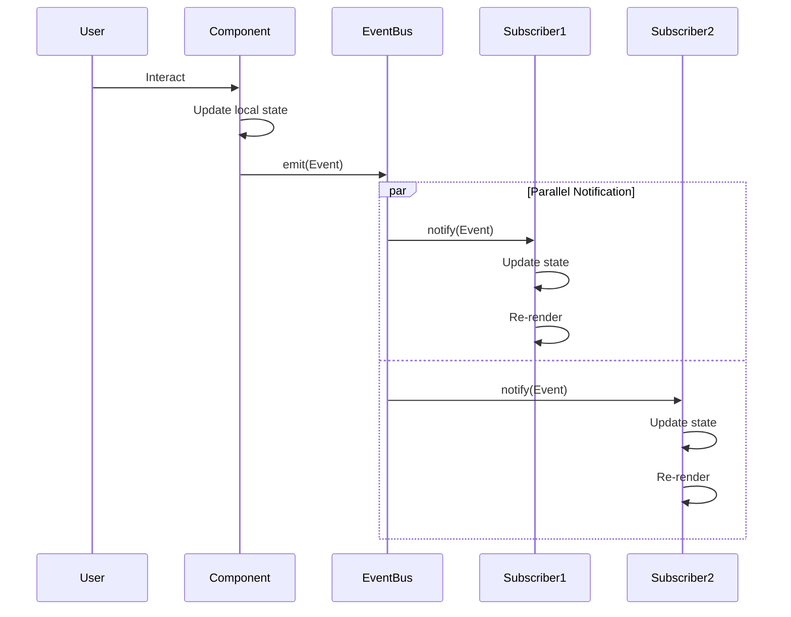
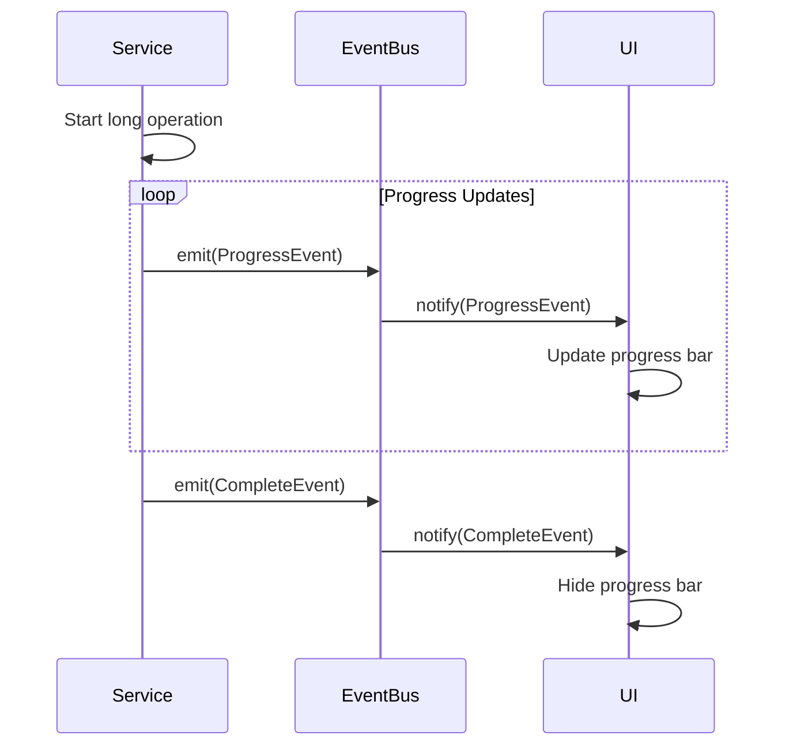
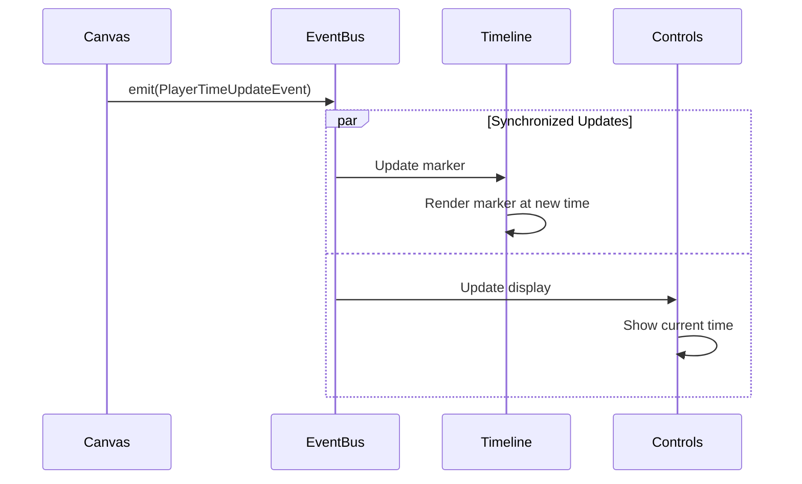

# Event Flow Architecture

## Overview
The application uses a centralized EventBus for decoupled communication between components. This document maps all events, their publishers, and subscribers.

## Event System Architecture


## Event Catalog

### 1. PlayerTimeUpdateEvent
**Event Name**: `player:timeUpdate`  
**Published By**: `VideoCanvas`  
**Subscribers**: `Timeline`, `StudioControls`

**Purpose**: Notify when the player's playback time changes

**Payload**:
```typescript
{
  newTime: number,  // New playback time in milliseconds
  oldTime: number   // Previous playback time
}
```

**Usage**:
- Update timeline marker position
- Update time display in controls
- Synchronize audio playback

---

### 2. PlayerLayerTransformedEvent
**Event Name**: `player:layerTransformed`  
**Published By**: `VideoCanvas` (via `CanvasLayer`)  
**Subscribers**: `Timeline`, `ControlHandler`

**Purpose**: Notify when a layer is transformed (moved, scaled, rotated) on the canvas

**Payload**:
```typescript
{
  layer: AbstractMedia  // The transformed mediaclip layer
}
```

**Usage**:
- Update timeline layer visualization
- Update transformation control inputs (x, y, scale, rotation)
- Trigger re-render of dependent components

---

### 3. TimelineTimeUpdateEvent
**Event Name**: `timeline:timeUpdate`  
**Published By**: `Timeline`  
**Subscribers**: `VideoCanvas`, `AudioSource`

**Purpose**: Notify when user interacts with timeline (scrubbing, seeking)

**Payload**:
```typescript
{
  newTime: number,  // New timeline time in milliseconds
  oldTime: number   // Previous timeline time
}
```

**Usage**:
- Seek video canvas to new time
- Stop/reset audio playback
- Pause video if playing

---

### 4. TimelineLayerUpdateEvent
**Event Name**: `timeline:layerUpdate`  
**Published By**: `Timeline`  
**Subscribers**: `VideoCanvas`, `MediaService`, `Studio`

**Purpose**: Notify when layers are added, removed, updated, or reordered

**Payload**:
```typescript
{
  action: 'add' | 'remove' | 'update' | 'reorder',
  layer: MediaInterface,
  oldLayer?: MediaInterface,  // For update action
  extra?: {                    // For reorder action
    fromIndex: number,
    toIndex: number
  }
}
```

**Usage**:
- Synchronize canvas layers with timeline
- Update mediaclip collections
- Recalculate total timeline duration
- Update layer rendering order

---

### 5. TranscriptionRemoveIntervalEvent
**Event Name**: `transcription:removeInterval`  
**Published By**: `TranscriptionView`  
**Subscribers**: `MediaService`

**Purpose**: Request removal of audio/video interval (silence removal)

**Payload**:
```typescript
{
  startTime: number,  // Start time in seconds
  endTime: number     // End time in seconds
}
```

**Usage**:
- Remove audio segments from audio layers
- Remove video frames from video layers
- Update layer timings
- Re-render timeline and canvas

---

### 6. TranscriptionSeekEvent
**Event Name**: `transcription:seek`  
**Published By**: `TranscriptionView`  
**Subscribers**: `Timeline`, `VideoCanvas`

**Purpose**: Seek to a specific timestamp from transcription

**Payload**:
```typescript
{
  timestamp: number  // Target time in milliseconds
}
```

**Usage**:
- Update timeline position
- Seek canvas to timestamp
- Update time marker

---

### 7. UiSpeedChangeEvent
**Event Name**: `ui:speedChange`  
**Published By**: `SpeedControlInput`  
**Subscribers**: `MediaService`, `AudioService`, `Timeline`, `Canvas`

**Purpose**: Change playback speed for selected or all layers

**Payload**:
```typescript
{
  speed: number  // Speed multiplier (e.g., 0.5, 1.0, 1.5, 2.0)
}
```

**Usage**:
- Update mediaclip playback speed
- Apply pitch preservation to audio
- Recalculate frame timings
- Update timeline visualization
- Adjust audio playback rate

---

### 8. UiAspectRatioChangeEvent
**Event Name**: `ui:aspectRatioChange`  
**Published By**: `AspectRatioSelector`  
**Subscribers**: `VideoCanvas`, `Studio`

**Purpose**: Change canvas aspect ratio

**Payload**:
```typescript
{
  ratio: string,      // New aspect ratio (e.g., "16:9", "9:16", "1:1")
  oldRatio?: string   // Previous aspect ratio
}
```

**Usage**:
- Resize canvas dimensions
- Recalculate layer positions
- Update export dimensions
- Re-render canvas

---

### 9. MediaLoadUpdateEvent
**Event Name**: `mediaclip:loadUpdate`  
**Published By**: `MediaLoader`, `MediaService`  
**Subscribers**: `Studio`, `LoadingPopup`

**Purpose**: Report progress during mediaclip loading/processing

**Payload**:
```typescript
{
  layer: AbstractMedia,
  progress: number,              // 0-100
  ctx?: CanvasRenderingContext2D,
  audioBuffer?: AudioBuffer
}
```

**Usage**:
- Update loading progress bar
- Show loading popup
- Cache rendered frames
- Store audio buffer

---

### 10. RecordVideoFileCreatedEvent
**Event Name**: `recording:videoFileCreated`  
**Published By**: `RecordService`  
**Subscribers**: `Studio`

**Purpose**: Notify when screen recording is complete

**Payload**:
```typescript
{
  videoFile: File  // Recorded video medialibrary
}
```

**Usage**:
- Load recorded video into studio
- Add to timeline automatically
- Show preview

---

## Event Flow Patterns

### Pattern 1: User Interaction → Event → UI Update



### Pattern 2: Service Operation → Progress Events



### Pattern 3: Cross-Component Synchronization



---

## Event Subscription Map

### VideoCanvas
**Subscribes To**:
- `TimelineTimeUpdateEvent` → Seek to timeline time
- `TimelineLayerUpdateEvent` → Update layer collection
- `UiAspectRatioChangeEvent` → Resize canvas

**Publishes**:
- `PlayerTimeUpdateEvent` → Time changes during playback
- `PlayerLayerTransformedEvent` → Layer transformed by user

---

### Timeline
**Subscribes To**:
- `PlayerTimeUpdateEvent` → Update time marker
- `PlayerLayerTransformedEvent` → Update layer display
- `UiSpeedChangeEvent` → Recalculate layer widths

**Publishes**:
- `TimelineTimeUpdateEvent` → User scrubs timeline
- `TimelineLayerUpdateEvent` → Layers added/removed/reordered

---

### MediaService
**Subscribes To**:
- `TimelineLayerUpdateEvent` → Track mediaclip changes
- `TranscriptionRemoveIntervalEvent` → Remove audio/video intervals
- `UiSpeedChangeEvent` → Update mediaclip speed

**Publishes**:
- `MediaLoadUpdateEvent` → Loading progress updates

---

### AudioService
**Subscribes To**:
- `PlayerTimeUpdateEvent` → Synchronize audio playback
- `TimelineTimeUpdateEvent` → Stop/reset audio
- `UiSpeedChangeEvent` → Adjust audio playback rate

**Publishes**: None directly (uses MediaService)

---

### StudioControls
**Subscribes To**:
- `PlayerTimeUpdateEvent` → Update time display

**Publishes**: None (uses direct method calls)

---

### TranscriptionView
**Subscribes To**: None directly

**Publishes**:
- `TranscriptionRemoveIntervalEvent` → Remove silence
- `TranscriptionSeekEvent` → Seek to timestamp

---

### SpeedControlInput
**Subscribes To**: None directly

**Publishes**:
- `UiSpeedChangeEvent` → Speed changed by user

---

### AspectRatioSelector
**Subscribes To**: None directly

**Publishes**:
- `UiAspectRatioChangeEvent` → Aspect ratio changed

---

### RecordService
**Subscribes To**: None directly

**Publishes**:
- `RecordVideoFileCreatedEvent` → Recording complete

---

## EventBus Implementation

### Core Methods

```typescript
class EventBus {
  // Subscribe to an event
  subscribe<T extends BaseEvent>(
    EventClass: EventClass<T>,
    handler: EventHandler<T>
  ): () => void

  // Subscribe once (auto-unsubscribe after first call)
  once<T extends BaseEvent>(
    EventClass: EventClass<T>,
    handler: EventHandler<T>
  ): void

  // Unsubscribe from an event
  unsubscribe<T extends BaseEvent>(
    EventClass: EventClass<T>,
    handler: EventHandler<T>
  ): void

  // Emit an event to all subscribers
  emit<T extends BaseEvent>(event: T): void

  // Clear all listeners (optional EventClass)
  clear<T extends BaseEvent>(EventClass?: EventClass<T>): void
}
```

### Usage Example

```typescript
import { getEventBus, PlayerTimeUpdateEvent } from '@/common';

const eventBus = getEventBus();

// Subscribe
const unsubscribe = eventBus.subscribe(
  PlayerTimeUpdateEvent,
  (event) => {
    console.log('Time updated:', event.newTime);
  }
);

// Emit
eventBus.emit(new PlayerTimeUpdateEvent(1000, 0));

// Unsubscribe
unsubscribe();
```

---

## Benefits of Event-Driven Architecture

### 1. Loose Coupling
- Components don't need direct references to each other
- Easy to add/remove components
- Simplified testing with mock events

### 2. Scalability
- New features can subscribe to existing events
- No need to modify existing components
- Clear separation of concerns

### 3. Flexibility
- Multiple subscribers for same event
- Events can be logged, debugged, or replayed
- Easy to add middleware (logging, analytics)

### 4. Maintainability
- Clear event contracts
- Self-documenting through event names
- Easy to trace data flow

### 5. Testability
- Components can be tested in isolation
- Events can be mocked
- No need for complex setup

