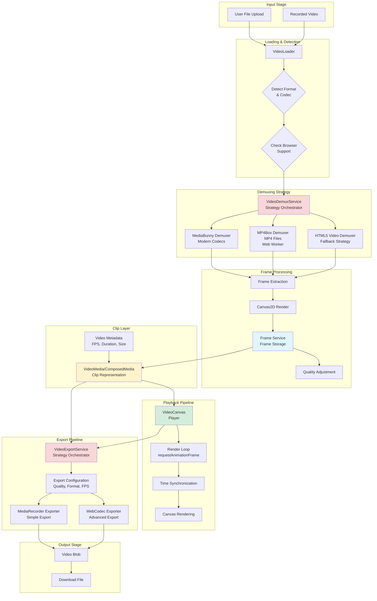
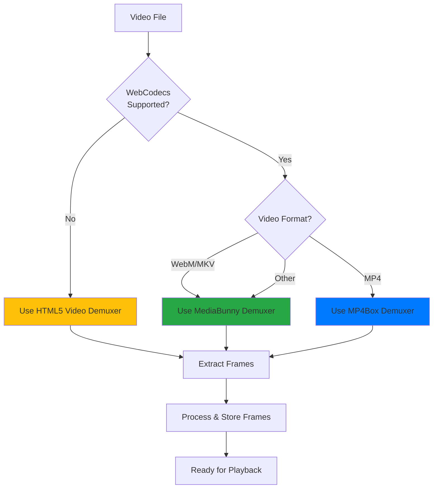
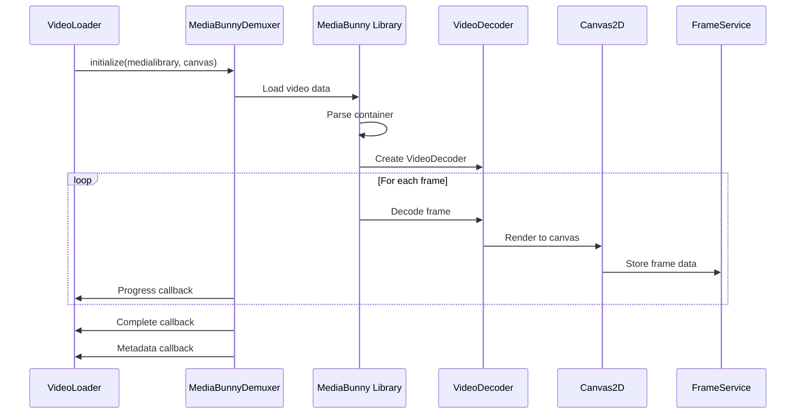
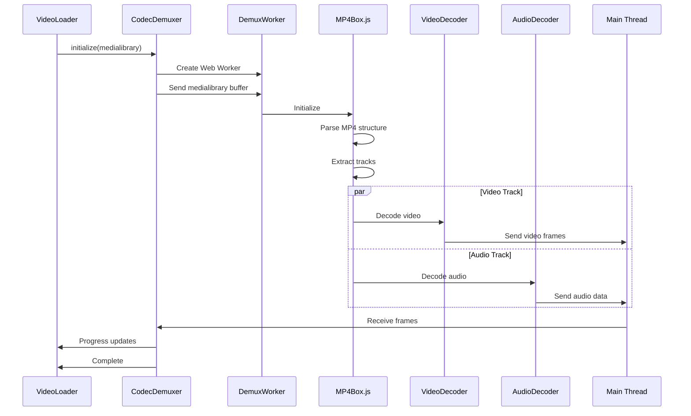
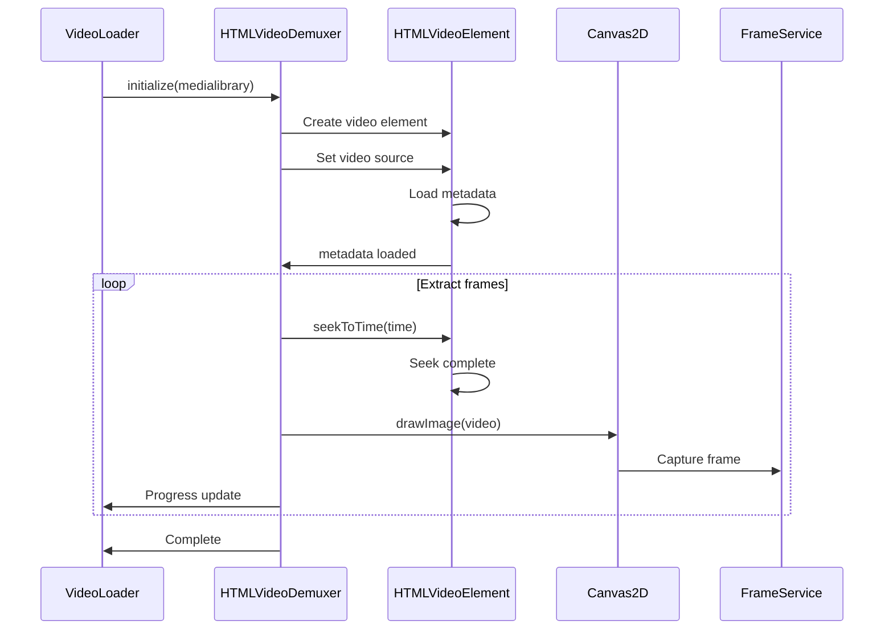
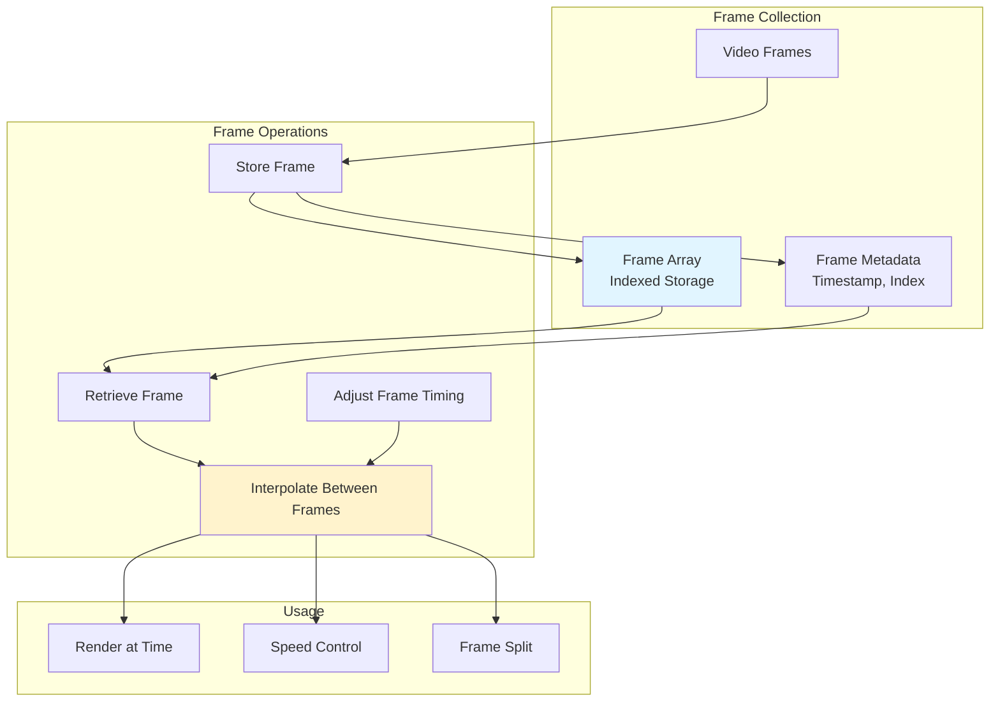
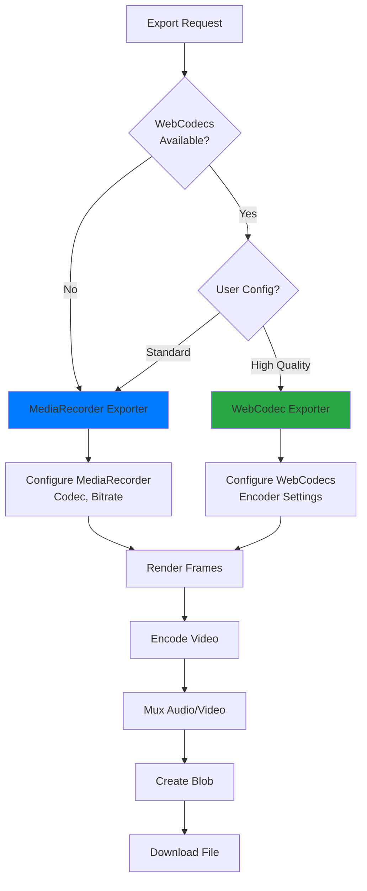
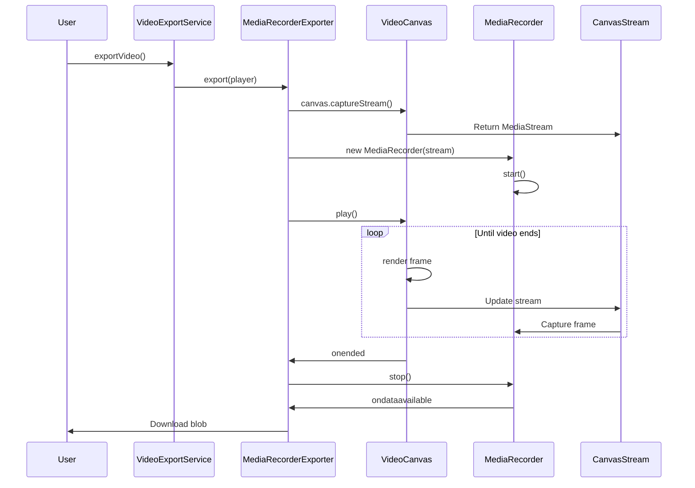
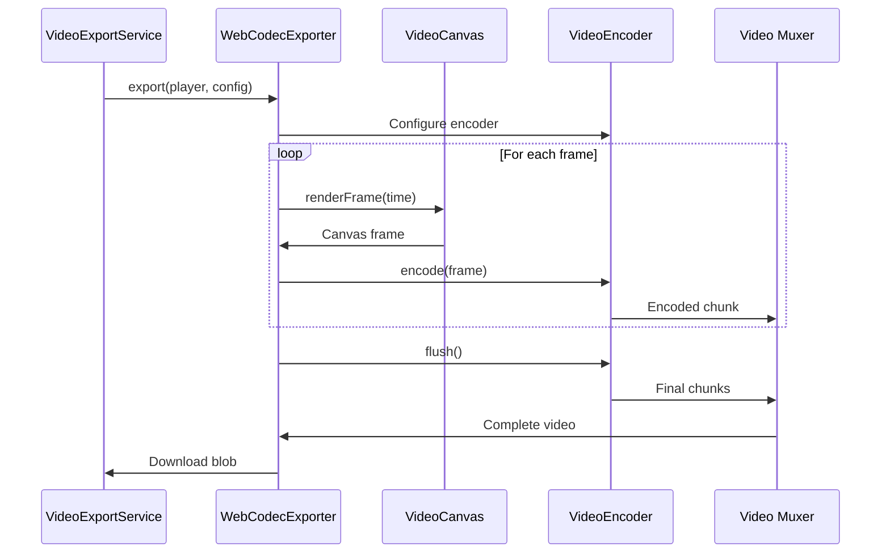

# Video Processing Pipeline

## Overview

The video processing pipeline handles video from import through demuxing, frame extraction, playback, and export. The system supports multiple demuxing and muxing strategies based on browser capabilities and video format.

## Complete Video Pipeline



## Demuxing Pipeline

### Strategy Selection



### MediaBunny Demuxer

**Purpose**: Modern demuxer for WebM, MKV, and other formats using WebCodecs.



**Key Features**:
- Uses native VideoDecoder API
- Efficient memory usage
- Progress tracking
- Supports modern codecs (VP8, VP9, AV1)

---

### MP4Box Demuxer

**Purpose**: Demux MP4 files using MP4Box.js in a Web Worker.



**Key Features**:
- Runs in Web Worker (non-blocking)
- Handles MP4 container format
- Separate video and audio decoding
- Supports H.264, H.265

**Worker Communication**:
```javascript
// Messages to worker
{ type: 'start', arrayBuffer: videoData }
{ type: 'stop' }

// Messages from worker
{ type: 'progress', progress: 50 }
{ type: 'videoFrame', frame: videoFrame }
{ type: 'audioData', data: audioData }
{ type: 'complete' }
```

---

### HTML5 Video Demuxer

**Purpose**: Fallback strategy using HTML5 video element when WebCodecs is unavailable.



**Key Features**:
- Browser compatibility (works everywhere)
- No special codec support needed
- Sequential frame extraction
- Automatic frame quality detection
- Slower than WebCodecs

**Frame Quality Optimization**:
```typescript
// Adjusts extraction based on video duration
class FrameQuality {
  determineQuality(duration: number): Quality {
    if (duration < 60) return 'high';      // < 1 min: extract all frames
    if (duration < 300) return 'medium';   // < 5 min: extract every 2nd
    return 'low';                          // > 5 min: extract every 3rd
  }
}
```

---

## Frame Management

### Frame Service Architecture



### Frame Retrieval

```typescript
class FrameService {
  // Get frame at specific time
  getFrameAtTime(time: number, fps: number): Frame {
    const frameIndex = Math.floor((time / 1000) * fps);
    return this.frames[frameIndex] || this.frames[this.frames.length - 1];
  }
  
  // Interpolate between frames for smooth playback
  interpolateFrame(frame1: Frame, frame2: Frame, ratio: number): Frame {
    // Blending logic for smooth transitions
  }
}
```

---

## Export Pipeline

### Export Strategy Selection



### MediaRecorder Exporter

**Purpose**: Simple export using MediaRecorder API with canvas stream.



**Advantages**:
- Simple implementation
- Wide browser support
- Automatic encoding
- Real-time capture

**Limitations**:
- Quality depends on canvas stream
- Limited codec control
- Cannot export faster than real-time

---

### WebCodec Exporter

**Purpose**: Advanced export with full control over encoding settings.



**Advantages**:
- Full quality control
- Custom bitrate and codec
- Can export faster than real-time
- Better compression

**Configuration**:
```typescript
interface ExportConfig {
  codec: 'h264' | 'vp8' | 'vp9' | 'av1';
  width: number;
  height: number;
  framerate: number;
  bitrate: number;  // bits per second
}
```

---

## Performance Optimizations

### 1. Web Worker for Heavy Processing
MP4Box demuxing runs in a Web Worker to avoid blocking the main thread.

### 2. Progressive Frame Loading
Frames are loaded progressively with progress callbacks.

### 3. Frame Quality Adaptation
HTML5 demuxer adjusts extraction rate based on video duration.

### 4. Canvas Caching
Frames are cached to avoid re-decoding.

### 5. Async Frame Extraction
Frames are extracted asynchronously to maintain UI responsiveness.

---

## Error Handling

### Demuxing Errors
```typescript
try {
  await demuxer.initialize(medialibrary, renderer);
} catch (error) {
  if (error.name === 'UnsupportedFormatError') {
    // Try fallback demuxer
  } else if (error.name === 'CorruptedFileError') {
    // Show error to user
  }
}
```

### Export Errors
```typescript
try {
  await exporter.export(player, config);
} catch (error) {
  if (error.name === 'CodecNotSupportedError') {
    // Fall back to MediaRecorder
  } else if (error.name === 'ExportTimeoutError') {
    // Retry with lower quality
  }
}
```

---

## Codec Support Matrix

| Codec | MediaBunny | MP4Box | HTML5 | Export |
|-------|------------|--------|-------|--------|
| H.264 | ✅ | ✅ | ✅ | ✅ |
| H.265 | ✅ | ✅ | ⚠️ | ⚠️ |
| VP8 | ✅ | ❌ | ✅ | ✅ |
| VP9 | ✅ | ❌ | ✅ | ✅ |
| AV1 | ✅ | ❌ | ⚠️ | ⚠️ |

✅ Full support  
⚠️ Browser-dependent  
❌ Not supported

---

## Video Metadata

```typescript
interface VideoMetadata {
  duration: number;        // milliseconds
  width: number;          // pixels
  height: number;         // pixels
  fps: number;            // frames per second
  codec: string;          // codec name
  frames: Frame[];        // extracted frames
  hasAudio: boolean;      // audio track present
}
```

---

## Best Practices

### 1. Progressive Enhancement
Use the best available demuxer, fall back gracefully.

### 2. Memory Management
Clean up video elements and decoders when done.

### 3. Progress Feedback
Always provide progress updates during long operations.

### 4. Error Recovery
Implement fallback strategies for unsupported formats.

### 5. Quality vs Performance
Balance frame extraction quality with performance needs.

