# Timeline & Media Layers Architecture

## Overview

The Timeline system provides a visual interface for arranging and manipulating medialayer. Media layers represent different types of content (video, audio, image, text) with unified interfaces for both timeline display and canvas rendering.

## Timeline System Architecture

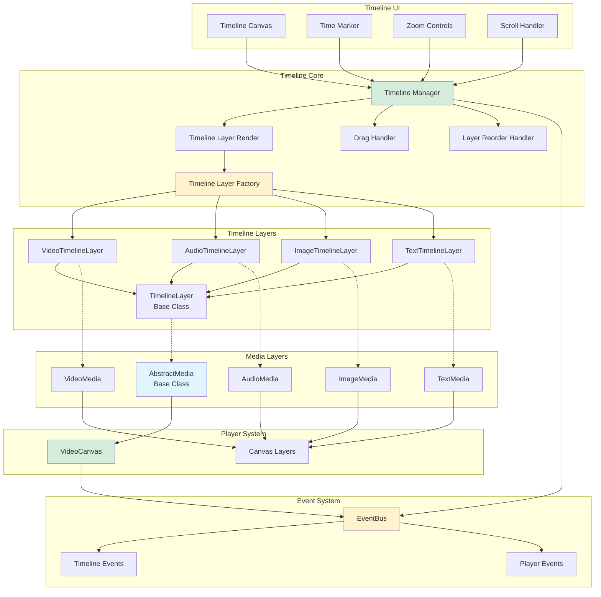

## Media Layer Hierarchy

### AbstractMedia Base Class

All medialayer types inherit from `AbstractMedia`, providing a unified interface.

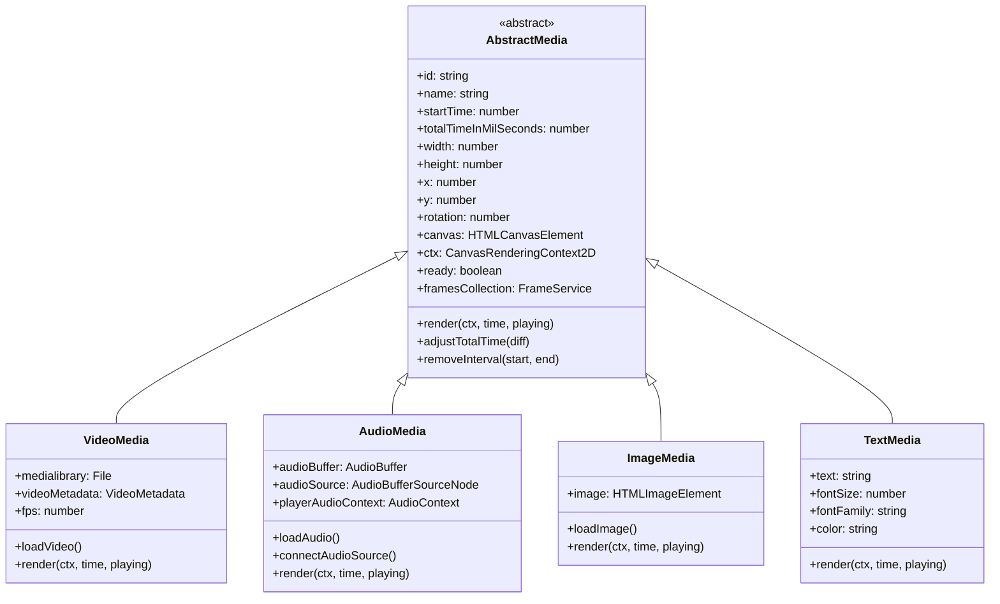

### Common Properties

All medialayer layers share:
- **Position**: `x`, `y` coordinates on canvas
- **Size**: `width`, `height` dimensions
- **Timing**: `startTime`, `totalTimeInMilSeconds`
- **Transform**: `rotation`, scale, opacity
- **Canvas**: Own canvas for rendering
- **State**: `ready` flag, loading progress

---

## Timeline Layer System

### Timeline Layer Factory

Creates appropriate timeline renderers based on medialayer type.

```typescript
class TimelineLayerFactory {
  static createTimelineLayer(
    ctx: CanvasRenderingContext2D,
    layer: MediaInterface,
    totalTime: number,
    canvasWidth: number
  ): TimelineLayer {
    const layerType = layer.constructor.name;
    
    switch (layerType) {
      case 'AudioMedia':
        return new AudioTimelineLayer(ctx, layer, totalTime, canvasWidth);
      case 'VideoMedia':
        return new VideoTimelineLayer(ctx, layer, totalTime, canvasWidth);
      case 'ImageMedia':
        return new ImageTimelineLayer(ctx, layer, totalTime, canvasWidth);
      case 'TextMedia':
        return new TextTimelineLayer(ctx, layer, totalTime, canvasWidth);
    }
  }
}
```

### Timeline Layer Rendering

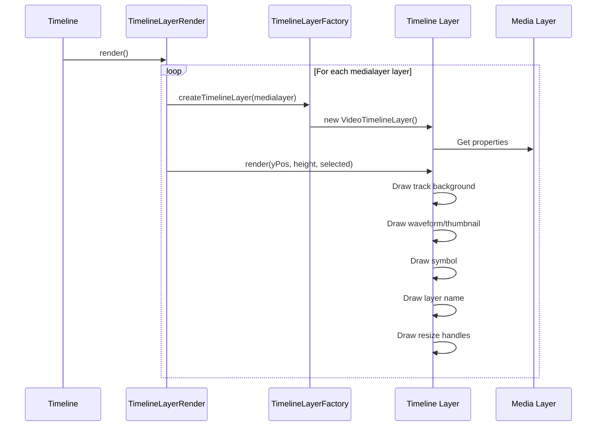

### Timeline Layer Types

#### VideoTimelineLayer
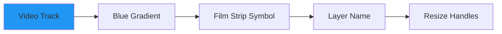

**Visual Features**:
- Blue color scheme
- Film strip icon (🎬)
- Thumbnail preview (if available)
- Waveform if audio present

---

#### AudioTimelineLayer
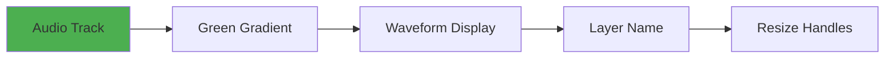

**Visual Features**:
- Green color scheme
- Audio waveform visualization
- Peak amplitude indicators
- Duration display

---

#### ImageTimelineLayer
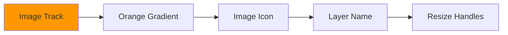

**Visual Features**:
- Orange color scheme
- Image icon (🖼️)
- Thumbnail preview
- Duration bar

---

#### TextTimelineLayer
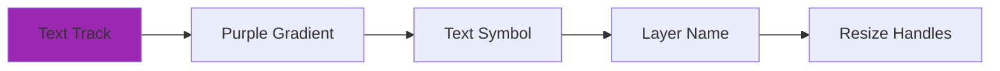

**Visual Features**:
- Purple color scheme
- "T" symbol
- Text preview
- Duration bar

---

## Timeline Interactions

### Drag and Drop

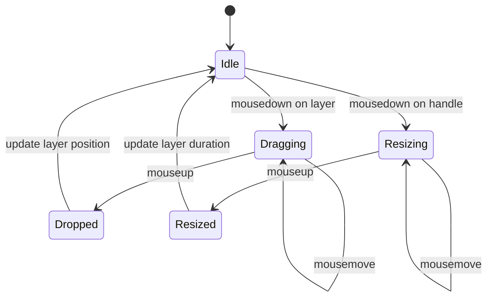

**Drag Handler**:
```typescript
class DragHandler {
  private draggedLayer: AbstractMedia | null = null;
  private dragStartX: number = 0;
  private dragStartTime: number = 0;
  
  onMouseDown(event: MouseEvent, layer: AbstractMedia): void {
    this.draggedLayer = layer;
    this.dragStartX = event.clientX;
    this.dragStartTime = layer.startTime;
  }
  
  onMouseMove(event: MouseEvent): void {
    if (!this.draggedLayer) return;
    
    const deltaX = event.clientX - this.dragStartX;
    const deltaTime = this.pixelsToTime(deltaX);
    
    this.draggedLayer.startTime = this.dragStartTime + deltaTime;
    this.emit(new TimelineLayerUpdateEvent('select', this.draggedLayer));
  }
}
```

### Layer Reordering

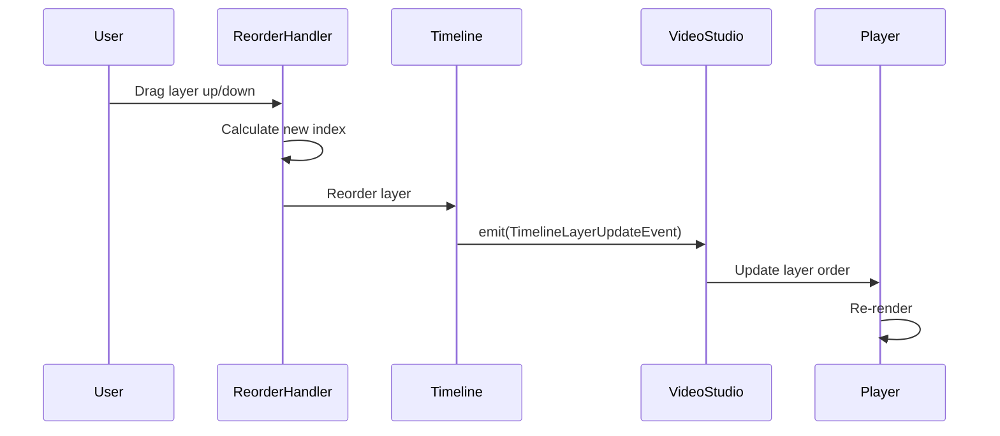

### Time Marker

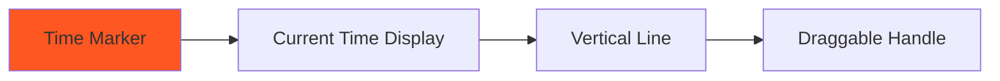

**Features**:
- Shows current playback time
- Draggable to seek
- Snaps to frames
- Synchronized with player

---

## Layer Operations

### Split Layer

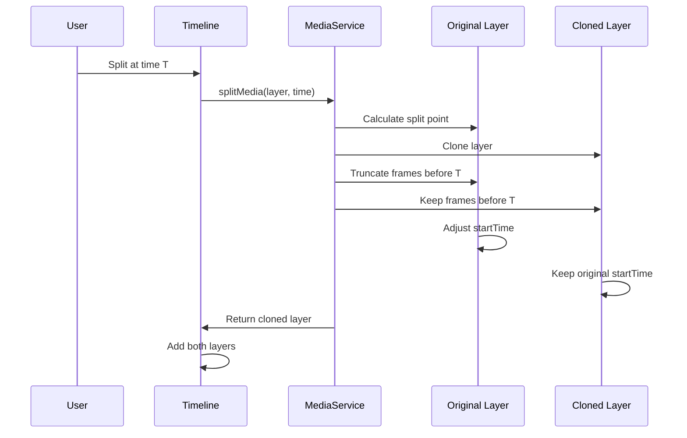

**Split Logic**:
```typescript
splitMedia(layer: AbstractMedia, splitTime: number): AbstractMedia {
  const clone = this.clone(layer);
  
  // Calculate percentage through layer
  const pct = (splitTime - layer.startTime) / layer.totalTimeInMilSeconds;
  const splitIndex = Math.round(pct * layer.framesCollection.frames.length);
  
  // Clone gets frames before split
  clone.framesCollection.frames = layer.framesCollection.frames.splice(0, splitIndex);
  clone.totalTimeInMilSeconds = pct * layer.totalTimeInMilSeconds;
  
  // Original gets frames after split
  layer.startTime = layer.startTime + clone.totalTimeInMilSeconds;
  layer.totalTimeInMilSeconds -= clone.totalTimeInMilSeconds;
  
  return clone;
}
```

---

### Clone Layer

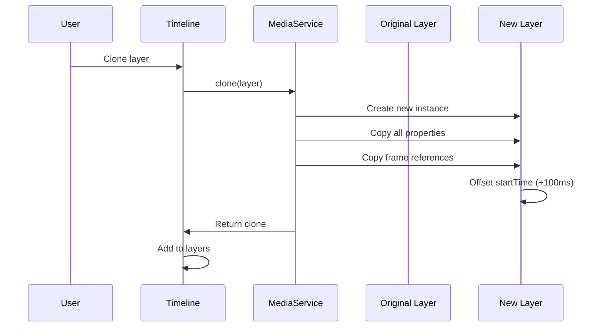

---

### Remove Interval

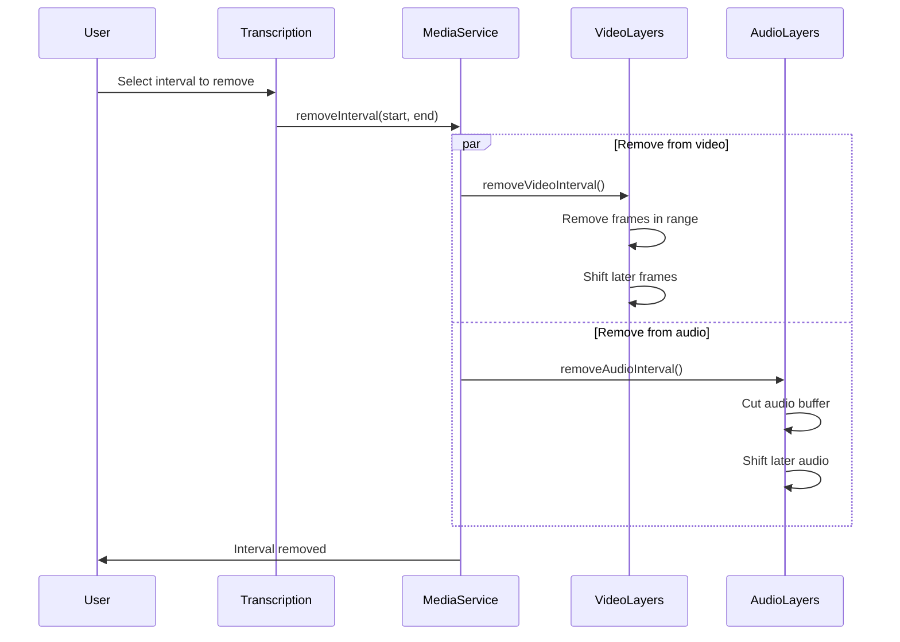

---

## Player Canvas Rendering

### Layer Rendering Order

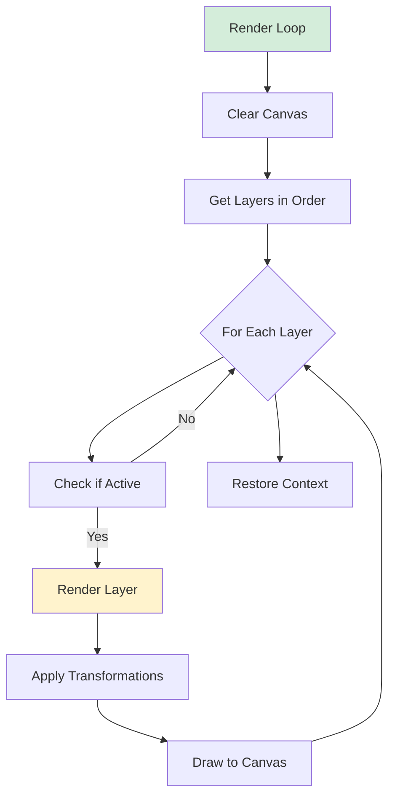

### Layer Transformation

```typescript
class CanvasLayer {
  render(ctx: CanvasRenderingContext2D, time: number, playing: boolean): void {
    const medialayer = this.medialayer;
    
    // Check if layer is active at current time
    if (time < medialayer.startTime || 
        time > medialayer.startTime + medialayer.totalTimeInMilSeconds) {
      return;
    }
    
    ctx.save();
    
    // Apply transformations
    ctx.translate(medialayer.x, medialayer.y);
    ctx.rotate(medialayer.rotation * Math.PI / 180);
    ctx.globalAlpha = medialayer.opacity || 1;
    
    // Render layer content
    medialayer.render(ctx, time - medialayer.startTime, playing);
    
    // Draw selection border if selected
    if (this.selected) {
      this.drawSelectionBorder(ctx);
      this.drawTransformHandles(ctx);
    }
    
    ctx.restore();
  }
}
```

---

## Time Synchronization

### Timeline ↔ Player Sync

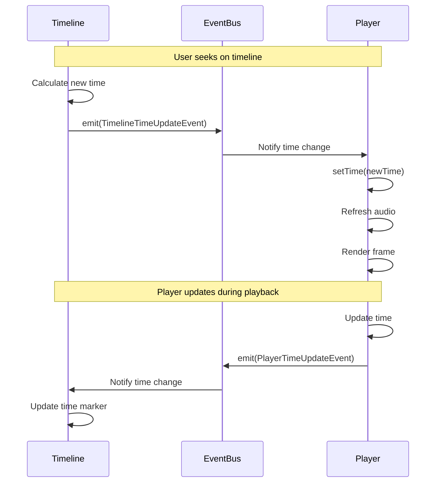

---

## Zoom and Pan

### Zoom Functionality

```typescript
class ZoomHandler {
  private zoomLevel: number = 1.0;
  private minZoom: number = 0.1;
  private maxZoom: number = 10.0;
  
  zoom(delta: number, centerX: number): void {
    const oldZoom = this.zoomLevel;
    this.zoomLevel = Math.max(this.minZoom, 
                              Math.min(this.maxZoom, 
                                      this.zoomLevel + delta));
    
    // Adjust scroll position to zoom toward cursor
    const scrollAdjust = centerX * (this.zoomLevel - oldZoom);
    this.timeline.scrollX += scrollAdjust;
    
    this.timeline.render();
  }
}
```

**Zoom Levels**:
- **0.1x**: See hours of content
- **1.0x**: Default view
- **10.0x**: Frame-by-frame precision

---

## Layer Properties

### Standard Layer Interface

```typescript
interface MediaInterface {
  id: string;
  name?: string;
  startTime: number;              // milliseconds
  totalTimeInMilSeconds: number;   // milliseconds
  
  // Adjust duration
  adjustTotalTime(diff: number): void;
  
  // Render at specific time
  render(ctx: CanvasRenderingContext2D, time: number, playing?: boolean): void;
}
```

### Transform Properties

```typescript
interface TransformProperties {
  x: number;          // X position on canvas
  y: number;          // Y position on canvas
  width: number;      // Width in pixels
  height: number;     // Height in pixels
  rotation: number;   // Rotation in degrees
  scaleX: number;     // Horizontal scale
  scaleY: number;     // Vertical scale
  opacity: number;    // 0.0 to 1.0
}
```

---

## Best Practices

### 1. Layer Lifecycle
```typescript
class MediaLayer {
  load() {
    // Load resources
  }
  
  render(ctx, time, playing) {
    // Render content
  }
  
  cleanup() {
    // Clean up resources
  }
}
```

### 2. Performance Optimization
- Cache rendered frames
- Only render visible layers
- Use requestAnimationFrame for smooth updates
- Debounce timeline updates

### 3. Error Handling
- Handle missing frames gracefully
- Validate time ranges
- Check canvas context availability

### 4. User Feedback
- Show loading state during operations
- Provide visual feedback for drag operations
- Display layer information on hover

### 5. Accessibility
- Keyboard shortcuts for common operations
- Clear visual indicators
- Screen reader support for timeline

