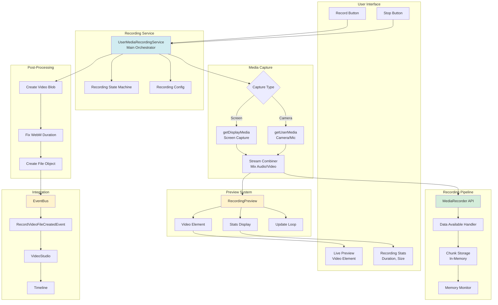
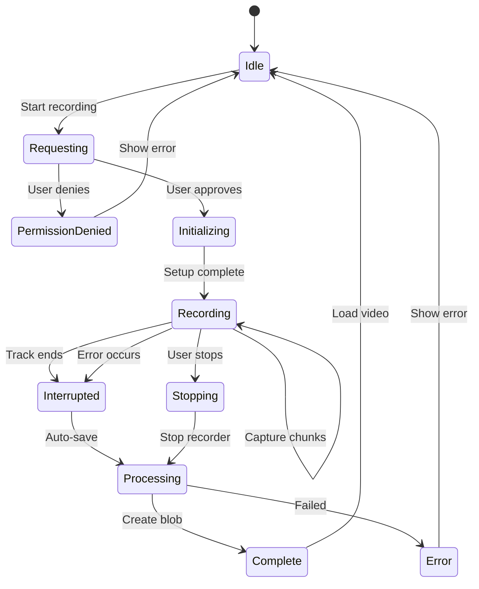
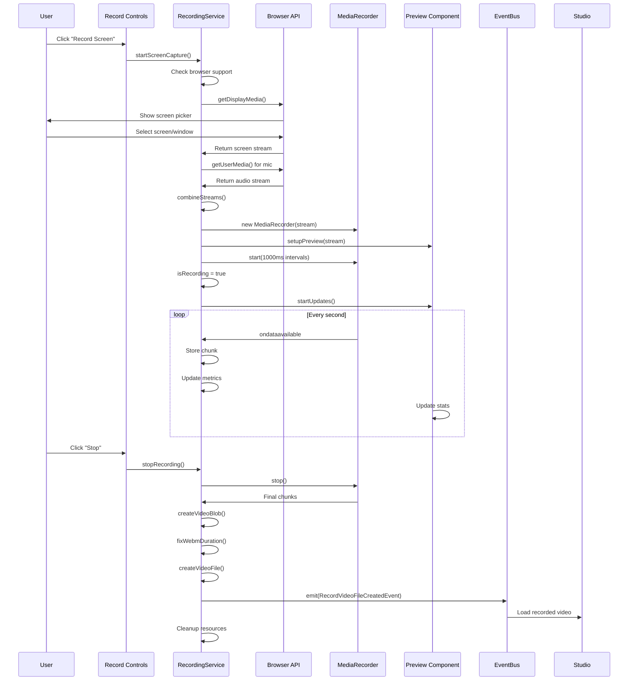
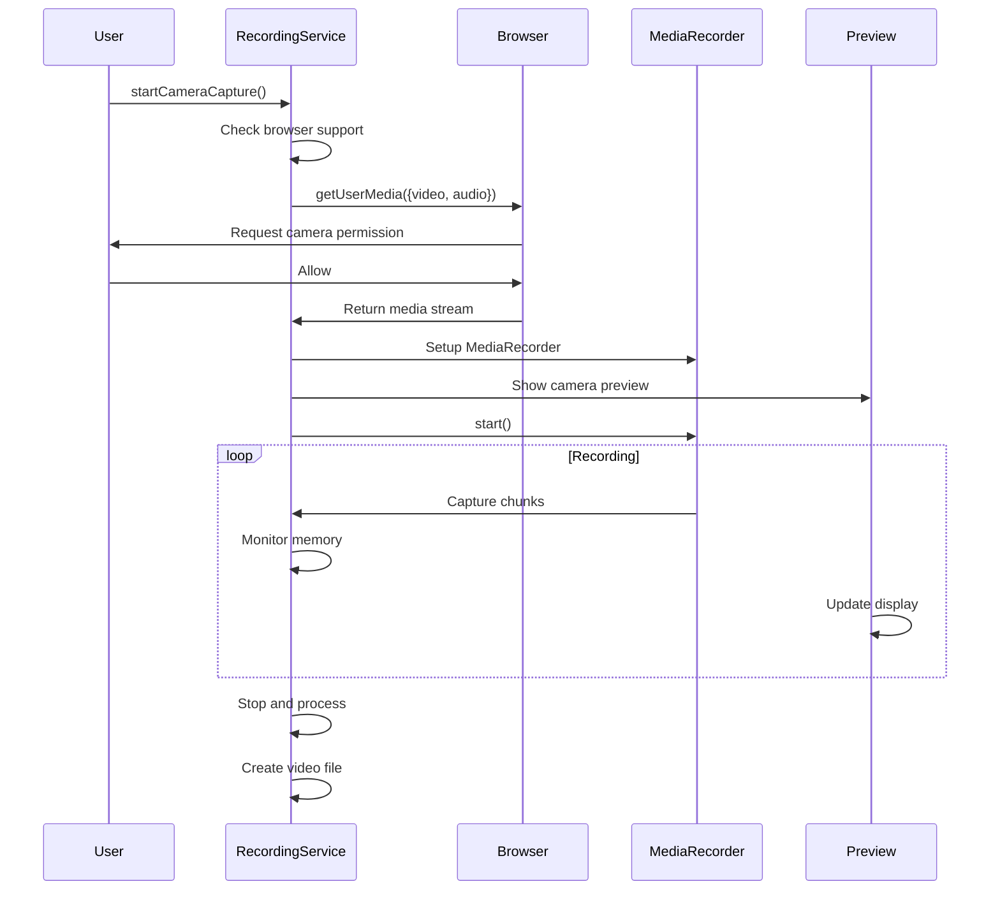
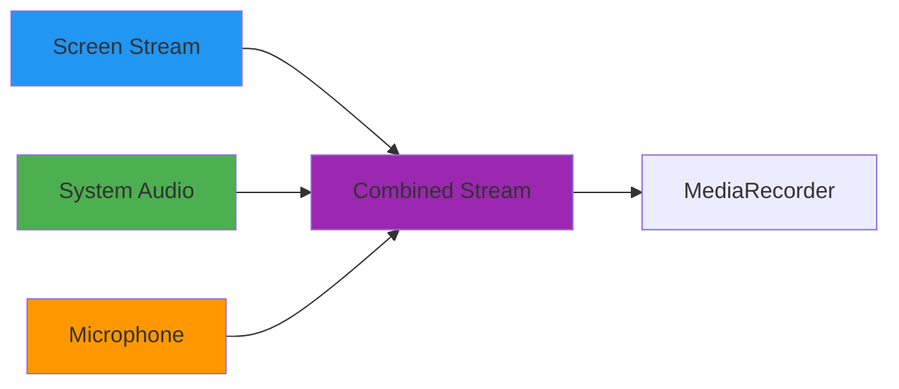
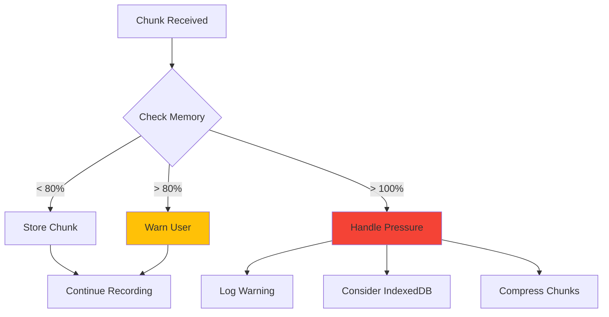
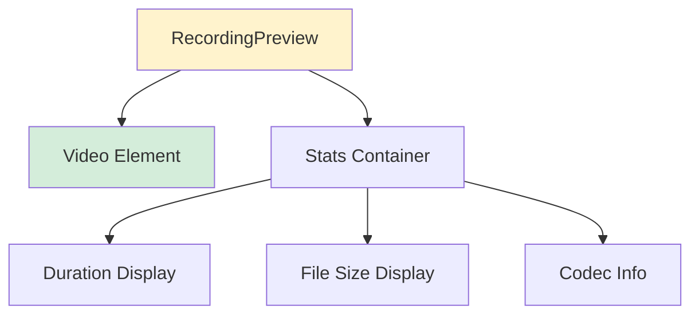
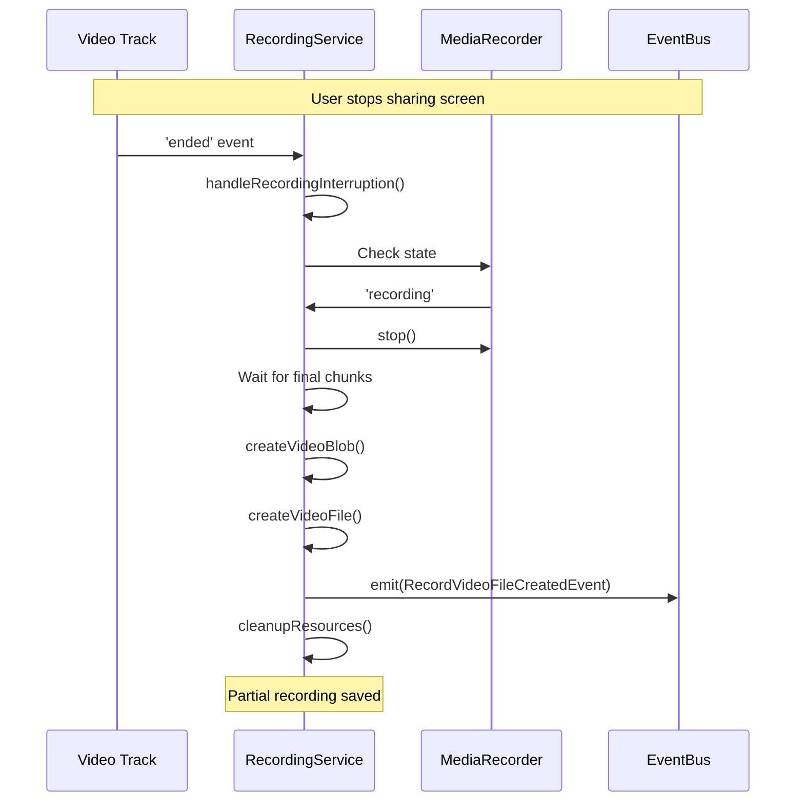
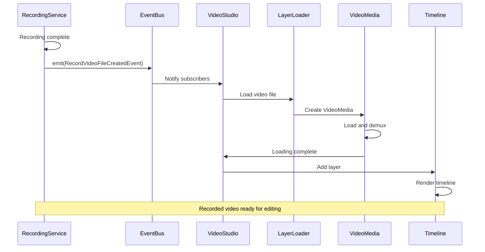

# Recording System Architecture

## Overview

The recording system enables users to capture screen content or camera feeds directly in the browser. It handles MediaStream capture, recording, preview, and integration with the video editor.

## Recording System Architecture



## Recording State Machine



## Recording Flow

### Screen Recording Flow



### Camera Recording Flow



## Component Details

### UserMediaRecordingService

**Responsibilities**:
- Orchestrate recording workflow
- Manage MediaRecorder lifecycle
- Handle stream combining
- Monitor memory usage
- Process recorded data
- Emit completion events

**Key Properties**:
```typescript
class UserMediaRecordingService {
  private mediaStream: MediaStream | null;
  private mediaRecorder: MediaRecorder | null;
  private recordedChunks: Blob[];
  private recordingStartTime: number | null;
  private maxMemoryUsage: number = 100 * 1024 * 1024; // 100MB
  private currentMemoryUsage: number;
  
  public isRecording: boolean;
}
```

---

### Media Capture

#### Screen Capture
```typescript
async startScreenCapture(): Promise<void> {
  // Get screen stream
  const screenStream = await navigator.mediaDevices.getDisplayMedia({
    video: {
      width: 1920,
      height: 1080,
      frameRate: 30,
      mediaSource: 'screen'
    }
  });
  
  // Get microphone (optional)
  let micStream = null;
  try {
    micStream = await navigator.mediaDevices.getUserMedia({
      audio: {
        echoCancellation: true,
        noiseSuppression: true,
        sampleRate: 44100
      }
    });
  } catch (error) {
    console.warn('Microphone unavailable, continuing without');
  }
  
  // Combine streams
  this.mediaStream = this.combineStreams(screenStream, micStream);
  await this.startRecording();
}
```

#### Camera Capture
```typescript
async startCameraCapture(): Promise<void> {
  this.mediaStream = await navigator.mediaDevices.getUserMedia({
    video: {
      width: 1920,
      height: 1080,
      frameRate: 30,
      facingMode: 'user'
    },
    audio: {
      echoCancellation: true,
      noiseSuppression: true,
      sampleRate: 44100
    }
  });
  
  await this.startRecording();
}
```

---

### Stream Combining

Combines screen video, system audio, and microphone audio.



```typescript
combineStreams(
  screenStream: MediaStream,
  micStream: MediaStream | null
): MediaStream {
  const combined = new MediaStream();
  
  // Add video tracks from screen
  screenStream.getVideoTracks().forEach(track => {
    combined.addTrack(track);
  });
  
  // Add system audio from screen (if available)
  screenStream.getAudioTracks().forEach(track => {
    combined.addTrack(track);
    console.log('Added system audio');
  });
  
  // Add microphone audio
  if (micStream) {
    micStream.getAudioTracks().forEach(track => {
      combined.addTrack(track);
      console.log('Added microphone audio');
    });
  }
  
  return combined;
}
```

---

### MediaRecorder Setup

```typescript
setupMediaRecorder(): void {
  // Try codecs in order of preference
  const supportedMimeTypes = [
    'video/webm;codecs=vp9,opus',
    'video/webm;codecs=vp8,opus',
    'video/webm;codecs=h264,opus',
    'video/webm',
    'video/mp4;codecs=h264,aac',
    'video/mp4'
  ];
  
  let selectedMimeType = '';
  for (const mimeType of supportedMimeTypes) {
    if (MediaRecorder.isTypeSupported(mimeType)) {
      selectedMimeType = mimeType;
      console.log('Using codec:', mimeType);
      break;
    }
  }
  
  if (!selectedMimeType) {
    throw new Error('No supported video codec found');
  }
  
  // Create MediaRecorder
  this.mediaRecorder = new MediaRecorder(this.mediaStream!, {
    mimeType: selectedMimeType,
    videoBitsPerSecond: 8000000,  // 8 Mbps
    audioBitsPerSecond: 128000    // 128 kbps
  });
  
  // Set up event handlers
  this.mediaRecorder.ondataavailable = (event) => {
    this.handleDataAvailable(event);
  };
  
  this.mediaRecorder.onstop = () => {
    console.log('Recording stopped');
    this.isRecording = false;
  };
}
```

---

### Chunk Handling

```typescript
handleDataAvailable(event: BlobEvent): void {
  if (!event.data || event.data.size < 1) {
    return;
  }
  
  // Update metrics
  this.chunkCount++;
  this.currentMemoryUsage += event.data.size;
  this.totalFileSize += event.data.size;
  
  if (this.recordingStartTime) {
    this.recordingDuration = Date.now() - this.recordingStartTime;
  }
  
  // Store chunk
  this.recordedChunks.push(event.data);
  
  // Check memory usage
  if (this.currentMemoryUsage > this.maxMemoryUsage) {
    console.warn('Memory limit exceeded');
    this.handleMemoryPressure();
  }
  
  // Warn if approaching limit
  if (this.currentMemoryUsage > this.maxMemoryUsage * 0.8) {
    console.warn('Memory usage high:', this.formatBytes(this.currentMemoryUsage));
  }
}
```

---

### Memory Management



```typescript
handleMemoryPressure(): void {
  console.log('Handling memory pressure...');
  
  // Options for handling high memory:
  // 1. Write older chunks to IndexedDB
  // 2. Implement rolling buffer
  // 3. Compress chunks
  // 4. Warn user to stop soon
  
  console.warn('Memory usage high. Consider stopping recording soon.');
}
```

---

### Preview System



**Preview Features**:
- Live video preview
- Real-time duration counter
- File size tracking
- Codec information
- Clean, unobtrusive UI

```typescript
class RecordingPreview {
  private previewElement: HTMLVideoElement;
  private statsElement: HTMLDivElement;
  private updateInterval: number | null;
  
  setupPreview(stream: MediaStream): void {
    this.previewElement = document.createElement('video');
    this.previewElement.srcObject = stream;
    this.previewElement.autoplay = true;
    this.previewElement.muted = true; // Prevent feedback
    
    // Position preview
    this.previewElement.style.cssText = `
      position: fixed;
      bottom: 20px;
      right: 20px;
      width: 320px;
      border-radius: 8px;
      box-shadow: 0 4px 12px rgba(0,0,0,0.3);
      z-index: 1000;
    `;
    
    document.body.appendChild(this.previewElement);
  }
  
  startUpdates(getDataFn: () => RecordingData): void {
    this.updateInterval = window.setInterval(() => {
      const data = getDataFn();
      this.updateStats(data);
    }, 1000);
  }
  
  updateStats(data: RecordingData): void {
    const duration = this.formatDuration(data.duration);
    const size = this.formatBytes(data.fileSize);
    
    this.statsElement.innerHTML = `
      <div>⏱️ ${duration}</div>
      <div>💾 ${size}</div>
      <div>🎥 ${data.mimeType}</div>
    `;
  }
}
```

---

### Recording Interruption Handling



**Interruption Scenarios**:
1. **User stops screen sharing** - Save partial recording
2. **Browser tab closed** - Attempt auto-save
3. **MediaRecorder error** - Handle gracefully
4. **Memory limit exceeded** - Stop and save

```typescript
async handleRecordingInterruption(
  reason: string,
  error: Error | null = null
): Promise<void> {
  console.log(`Recording interrupted: ${reason}`, error);
  
  if (!this.isRecording) {
    return; // Already handled
  }
  
  try {
    if (this.mediaRecorder?.state === 'recording') {
      console.log('Attempting to save partial recording...');
      
      this.mediaRecorder.stop();
      await new Promise(resolve => setTimeout(resolve, 100));
      
      if (this.recordedChunks.length > 0) {
        const partialBlob = await this.createVideoBlob();
        if (partialBlob) {
          const videoFile = this.createVideoFile(partialBlob);
          this.eventBus.emit(new RecordVideoFileCreatedEvent(videoFile));
          console.log('Partial recording saved:', partialBlob.size, 'bytes');
        }
      }
    }
  } catch (cleanupError) {
    console.error('Error during interruption cleanup:', cleanupError);
  } finally {
    this.cleanupRecordingResources();
  }
}
```

---

### Post-Processing

#### Create Video Blob

```typescript
async createVideoBlob(): Promise<Blob | null> {
  if (this.recordedChunks.length === 0) {
    console.warn('No recorded chunks available');
    return null;
  }
  
  // Determine MIME type from first chunk
  const mimeType = this.recordedChunks[0].type || 'video/webm';
  
  const videoBlob = new Blob(this.recordedChunks, { type: mimeType });
  
  console.log('Video blob created:', {
    size: videoBlob.size,
    type: videoBlob.type,
    chunks: this.recordedChunks.length
  });
  
  // Fix WebM duration metadata
  return await fixWebmDuration(videoBlob);
}
```

#### Fix WebM Duration

WebM files from MediaRecorder often have incorrect duration metadata. This is fixed post-recording.

```typescript
async function fixWebmDuration(blob: Blob): Promise<Blob> {
  // Use webm-duration-fix library
  const fixedBlob = await ysFixWebmDuration(blob);
  return fixedBlob;
}
```

---

### Integration with Video Editor



---

## Browser Support

### Required APIs
- **MediaStream API** - Core streaming
- **MediaRecorder API** - Recording
- **getDisplayMedia** - Screen capture (Chrome 72+, Firefox 66+)
- **getUserMedia** - Camera/mic access

### Codec Support Matrix

| Browser | VP8 | VP9 | H.264 | AV1 |
|---------|-----|-----|-------|-----|
| Chrome | ✅ | ✅ | ✅ | ✅ |
| Firefox | ✅ | ✅ | ⚠️ | ⚠️ |
| Safari | ❌ | ❌ | ✅ | ❌ |
| Edge | ✅ | ✅ | ✅ | ✅ |

✅ Full support  
⚠️ Partial support  
❌ Not supported

---

## Error Handling

### Permission Errors
```typescript
catch (error) {
  if (error.name === 'NotAllowedError') {
    throw new Error('Screen capture permission denied');
  }
  if (error.name === 'NotFoundError') {
    throw new Error('No capture source available');
  }
  if (error.name === 'AbortError') {
    throw new Error('User canceled screen selection');
  }
}
```

### Recording Errors
- **Codec not supported** - Fall back to alternative codec
- **Memory exceeded** - Save partial recording
- **Track ended unexpectedly** - Auto-save and notify user
- **Browser not supported** - Show compatibility message

---

## Best Practices

### 1. Always Clean Up Resources
```typescript
cleanup(): void {
  if (this.mediaStream) {
    this.mediaStream.getTracks().forEach(track => track.stop());
  }
  if (this.mediaRecorder) {
    this.mediaRecorder = null;
  }
  this.preview.cleanup();
}
```

### 2. Monitor Memory Usage
Set reasonable limits and warn users when approaching them.

### 3. Provide Clear Feedback
Show preview, duration, and file size during recording.

### 4. Handle Interruptions Gracefully
Save partial recordings when possible.

### 5. Test Across Browsers
Different browsers have different codec and API support.

### 6. Optimize Bitrate
Balance quality and file size based on use case.

### 7. Fix WebM Metadata
Always fix duration after recording WebM files.

