# Data Flow Patterns

## Overview

This document describes the major data flow patterns in the Web Video Edit application, showing how data moves through the system from user input to final output.

## 1. Media Upload and Loading Flow

### Complete Upload Pipeline

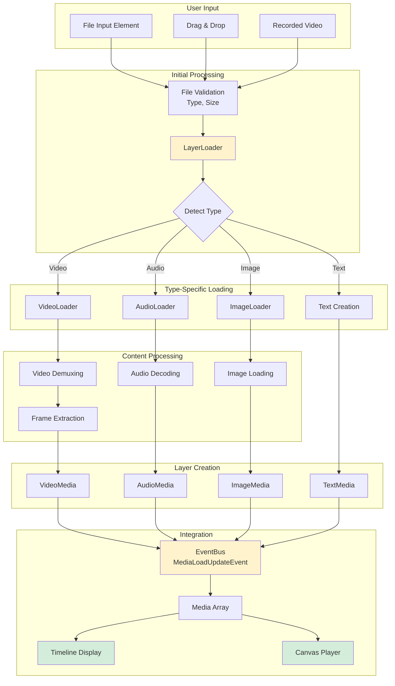

### Detailed Video Loading Flow

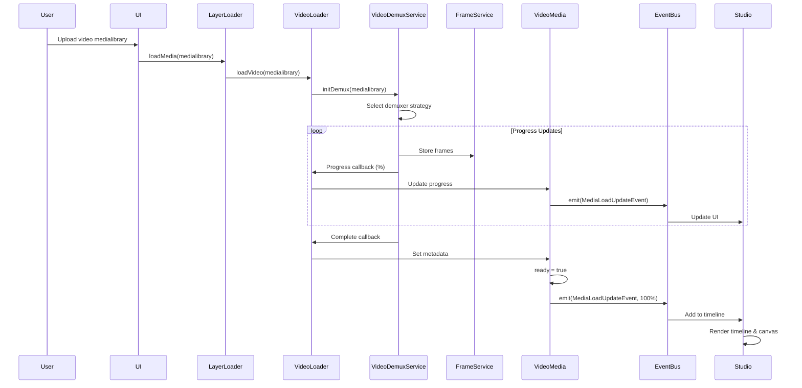

---

## 2. Playback Flow

### Real-time Playback Pipeline

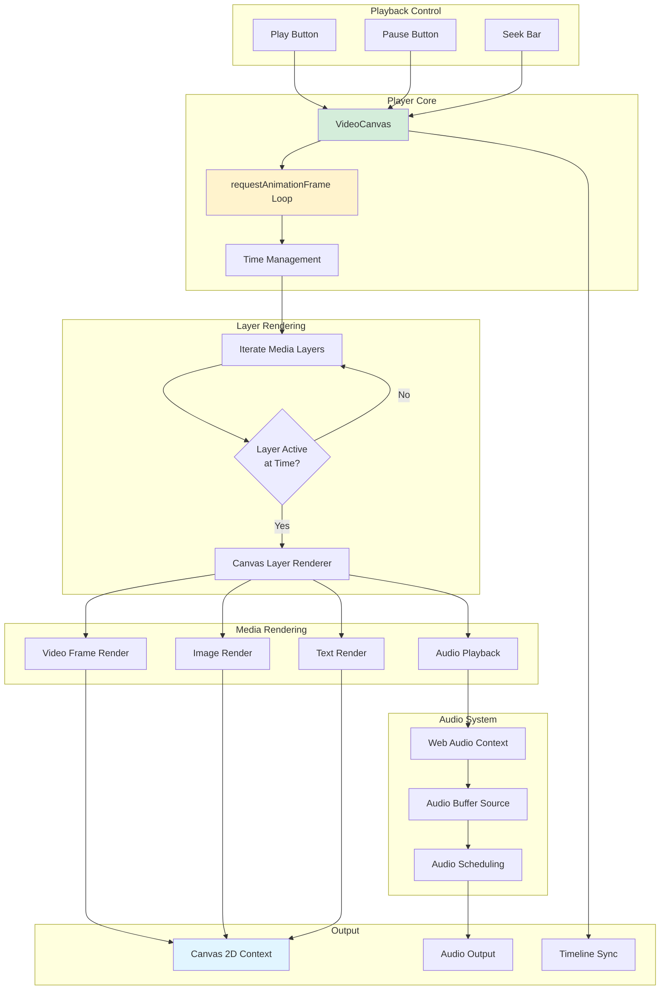

### Frame-by-Frame Playback Logic

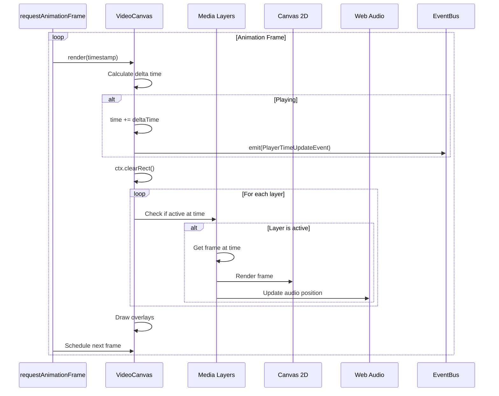

---

## 3. Timeline Interaction Flow

### Layer Manipulation on Timeline

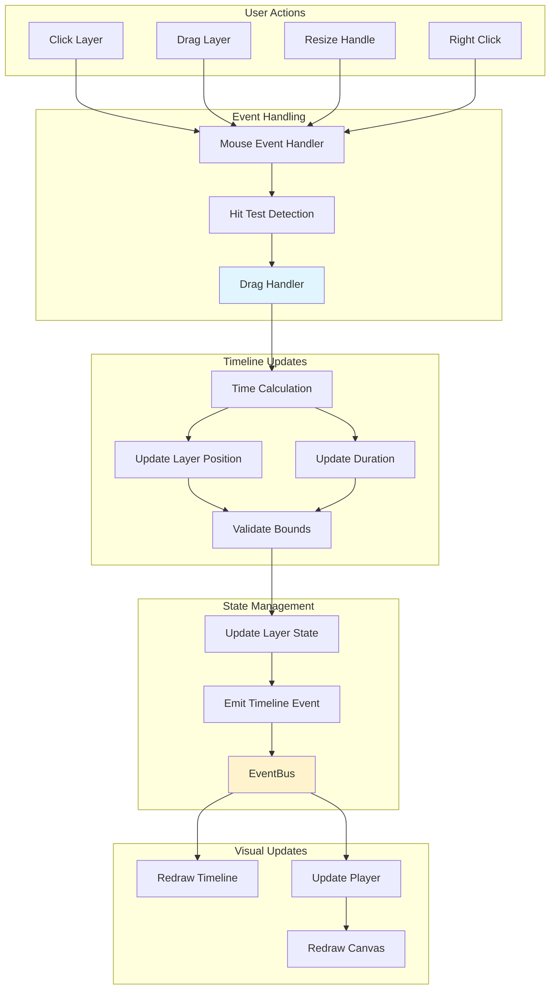

### Layer Split Flow

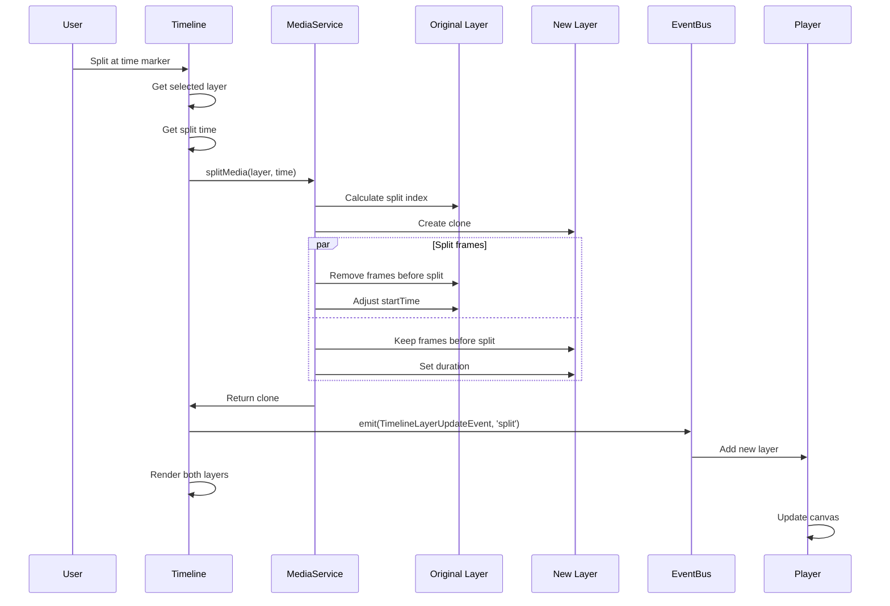

---

## 4. Export Flow

### Complete Export Pipeline

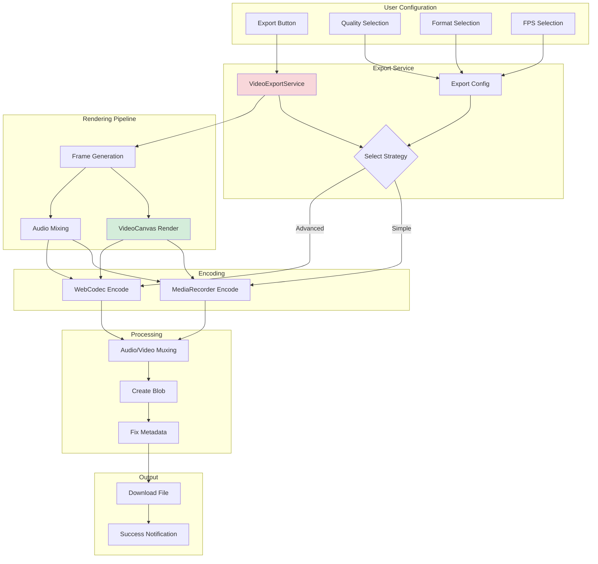

### Export Sequence

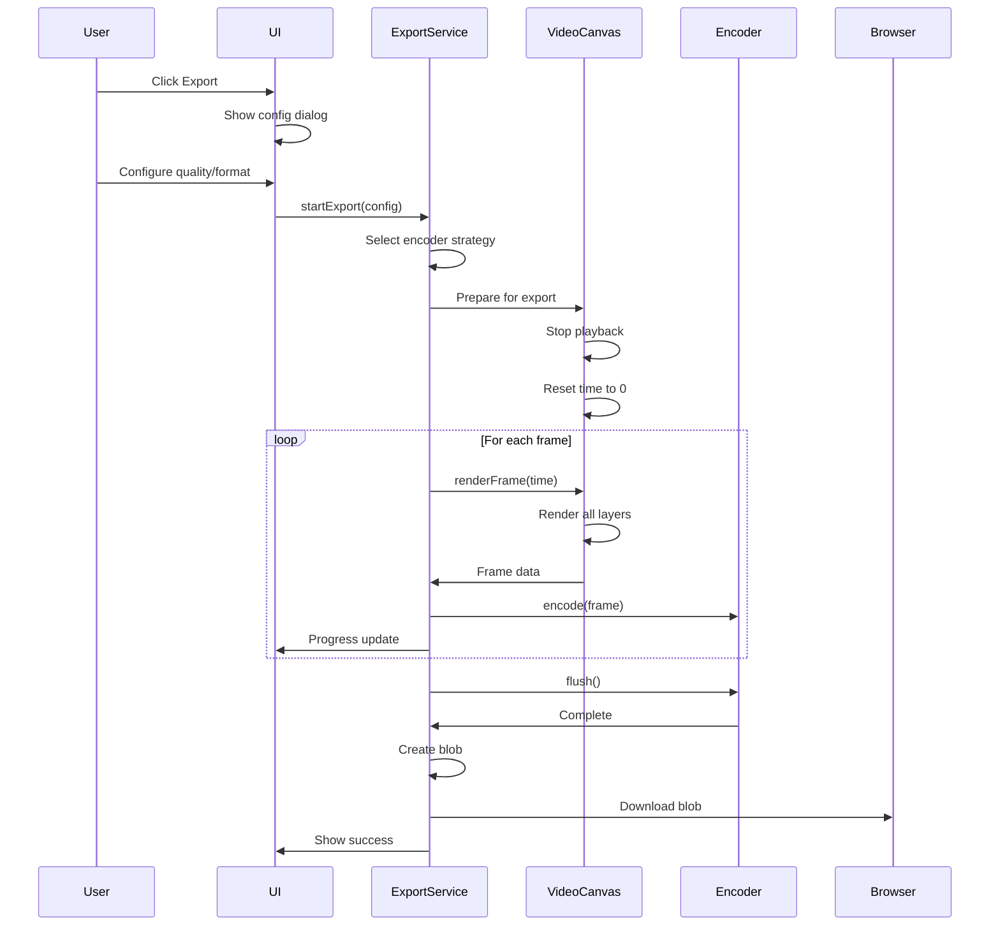

---

## 5. Recording to Edit Flow

### End-to-End Recording Integration

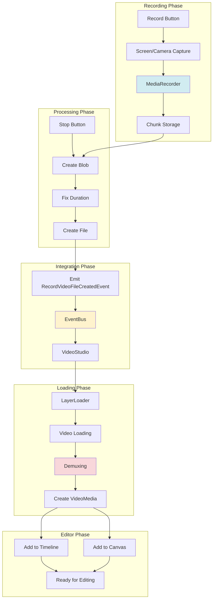

---

## 6. Transcription Flow

### AI Transcription Pipeline

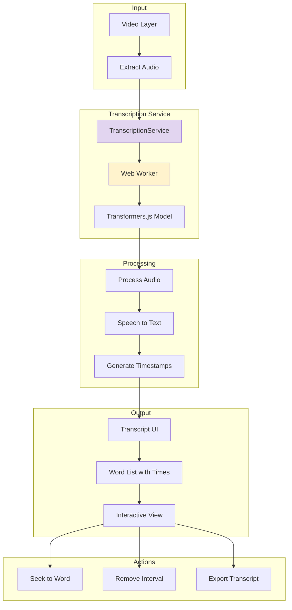

---

## 7. Event-Driven Data Flow

### Cross-Component Communication

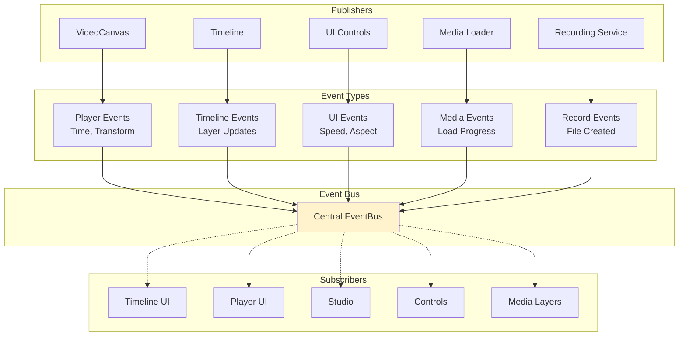

### Event Flow Example: Time Synchronization

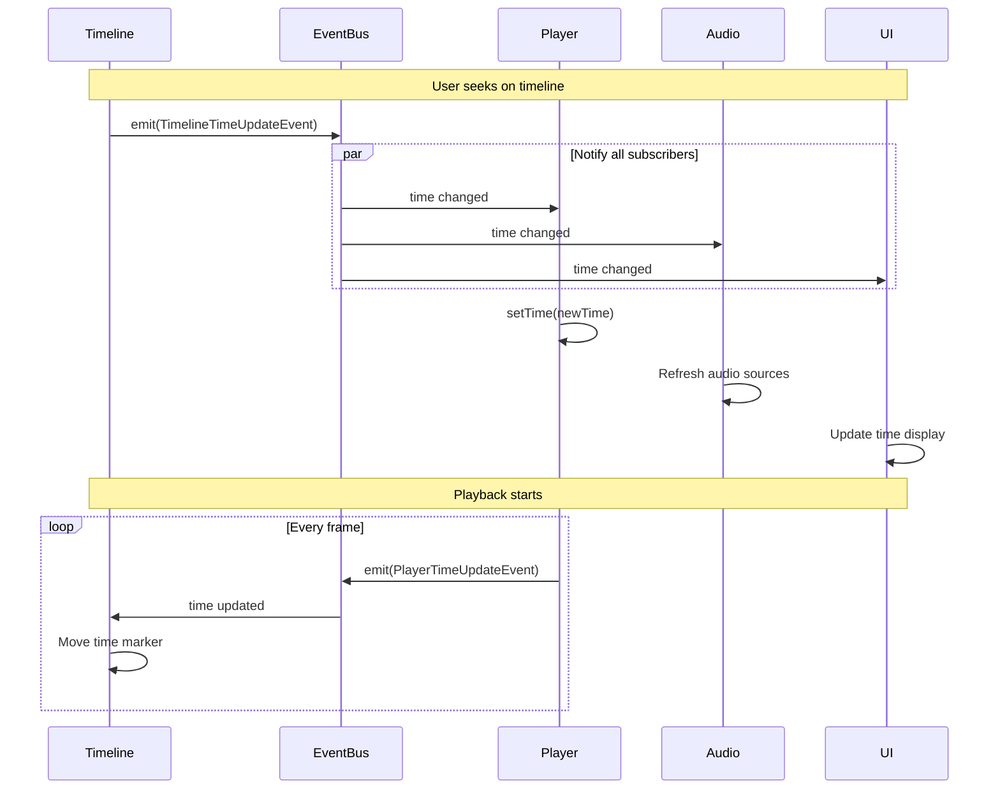

---

## 8. Clip Settings Update Flow

Shows how clip property changes flow through the system when a user edits clip properties.

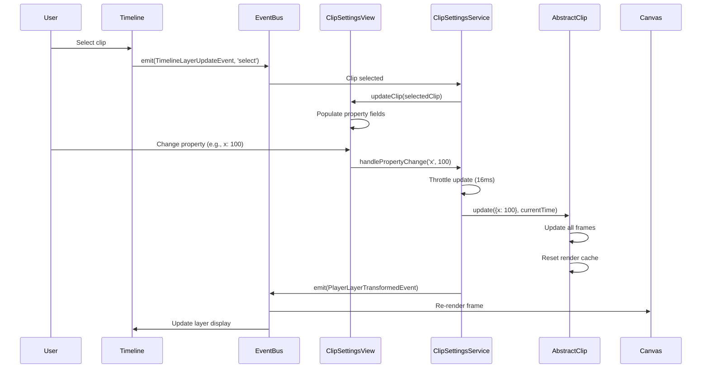

### Key Points
- Updates are throttled to 60fps (16ms) for smooth performance during real-time editing
- Transform properties (x, y, scale, rotation) use the `update()` method to modify all frames
- Timing properties (startTime, duration) use direct setters for immediate effect
- Speed changes use the SpeedController for pitch-preserved playback
- Render cache is invalidated to force visual refresh after property changes
- Event-driven architecture keeps Canvas and Timeline synchronized

---

## 9. State Management Flow

### Global State Updates

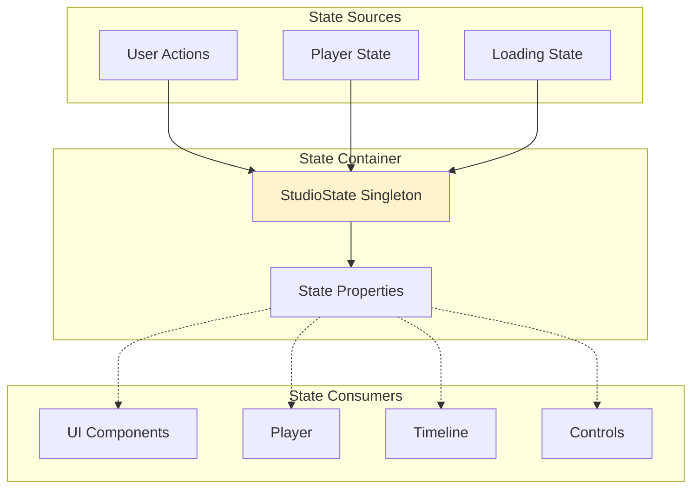

**State Properties**:
- Playing state (play/pause)
- Selected layer
- Current time
- Zoom level
- Aspect ratio
- Loading progress

---

## Data Flow Principles

### 1. Unidirectional Flow
Data flows in one direction: User Action → Processing → State Update → UI Update

### 2. Event-Driven Updates
Components communicate through events, not direct calls

### 3. Centralized State
Critical state lives in singletons (StudioState, EventBus)

### 4. Async Operations
Heavy operations (demuxing, transcription) run asynchronously with progress updates

### 5. Lazy Loading
Resources loaded on-demand to minimize initial load time

### 6. Memory Management
Large data (frames, audio buffers) cleaned up when not needed

### 7. Progressive Enhancement
Features degrade gracefully when APIs unavailable

---

## Performance Considerations

### 1. Frame Caching
Rendered frames cached to avoid re-rendering

### 2. Web Workers
Heavy processing (demuxing, transcription) in workers

### 3. Request Animation Frame
Smooth 60fps playback using RAF

### 4. Debouncing
UI updates debounced to avoid excessive renders

### 5. Virtual Scrolling
Timeline uses virtual scrolling for many layers

### 6. Lazy Frame Extraction
Frames extracted progressively during load

### 7. Audio Scheduling
Web Audio scheduled ahead for glitch-free playback

